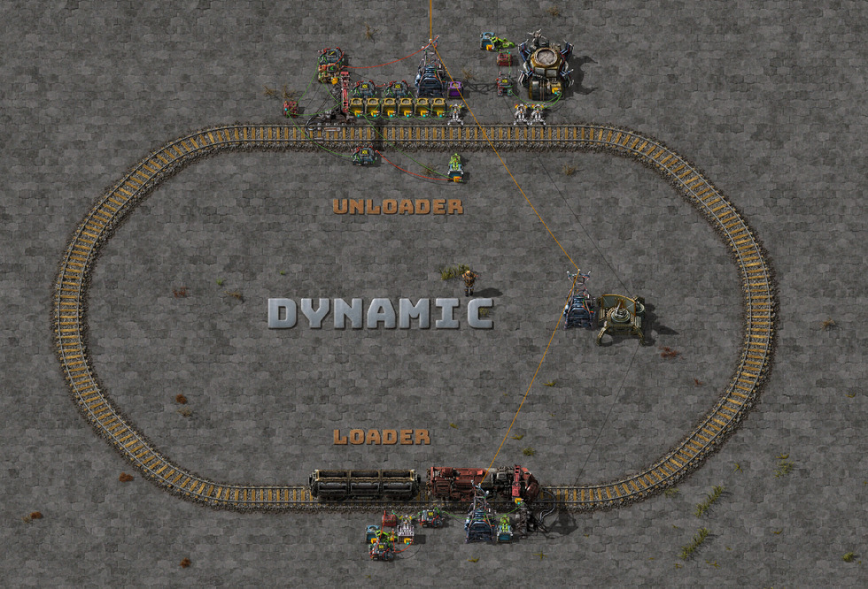
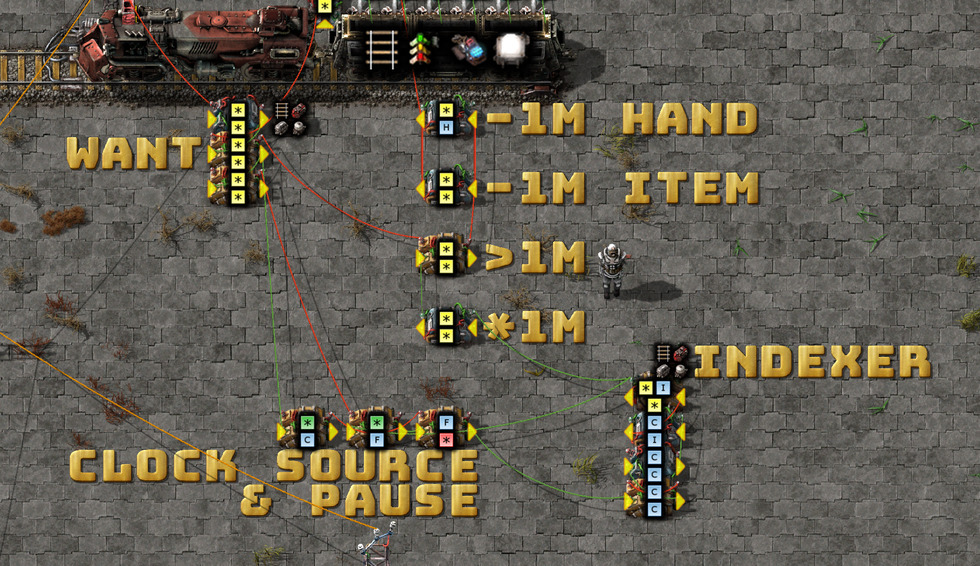

# My Factorio Logistic Train Evolution

I'm in love with this game. Factorio is a rare gem that allows you to sink 1000
hours into building factories, circuits and trains and yet still be learing
something new. I'm on my third map now and each has been an amazing learning
experience each time.

The most advanced circuits I've created so far have been vanilla logistic train
loaders which supplies all my wall defence, outpost, and other remote building
needs.

Since I began playing in March 2020 I've saved a daily snapshot of my factories
which I can now dig through to describe the evolution of my train logistic
systems (circuits).

There's a natural progression between the systems going from the simplest of
designs using per-item filter inserters:


To a module based, fast & exact logistic loaders/unloaders:


In this post I'll walk through how I got there and the problems I encountered
along the way.

## Simple: reserved wagon slots


Middle-click on each cargo wagon slot to filter it to a specific item. I used
this to create several trains for different purposes:

* Wall/defence supplies (ammo, walls, lasers)
* Build train (inserters, chests, power poles, etc)
* Solar

The schedule would be set to full cargo and then sit waiting for an outpost to
enable itself when short on supplies.

The unloader is the inverse of the loader: filter inserters to remove only
specific items into space restricted provider chests.


The circuit above will count the number of unique items in the chest. I wired
this to the train stop to enable when `[tick] != 12`:


The leaving schedule should be inactivity (which may depend on your bot speed, I
used between 5-10 seconds almost everywhere).

### Pros

Simplicity and compactness win big here. You can also increase the number of
cargo wagons to transport around more item types (24, 36, ...) or more of each.

### Cons

#### Adding that 13th item..

A dead-end that I hit when trying to extend this system beyond 12 items per
wagon was stuck inserters. In this requester chest I configured passive provider
chests and lasers. Unless the hand completely empties into the wagon it will
stall and never insert the other item types:


Micro-managing inserter stack sizes is a reoccuring theme with the more complex
logistic circuits.

Best to use additional wagons for more items with this design.

### Train requester gate

Add a wall and gate to detect the player. Make the wall-gate connection output
`[tick] 1` to activate the `[tick] != 12` condition and the train will be
dispatched to pick you up!

### Trash wagon

A simple addition to the previous setup is a separate wagon for returning waste
(rocks, trees, deconstruction waste) back to base for use/disposal.

### Direct robo-insertion

A pain point when setting up a new logistic unloader outpost was inserting the
initial logistic bots manually. Like chests you can insert bots directly into
the roboport from the wagon. I replaced the first two passive chests with the
corner of the roboport.


A circuit connection to the roboport will let you inspect bot stats to
conditionally enable the inserter up to a desired threshold (e.g. `[logistic
bots] < 100`).


After a while I noticed a problem: waves of biter attacks were burning through
my bots. I needed a way to monitor my bot levels and request a stock-up when
they reached cricital levels. Enter the two additional decider combinators on
the left. Both are wired up to the roboport to check the bot-stats and both will
output `[tick] 1` when their conditions are true `[construction bots] > 50` and
`[logistic bots > 50]`.


No changes to the train stop condition `[tick] != 12` is needed. The train
station will be auto disabled when:

* Construction bots > 50
* Logistic bots > 50
* Number of unique items in chests == 10

### Train stacker

I was reaching throughput capacity of a single train and decided to add
multiple. Simple right?


### Multiple trains, dynamic stops & no-pathing nightmares

Multiple trains and dynamic train stops are a recipie for disaster. I found that
the eager-beaver that made it to the outpost first will de-activate the train
stop and no-path the other in-flight trains in the middle of critical
intersections stalling my entire train network. I made the incorrect assumption
that if there were no train stops active the train will automatically skip to
the next in the schedule and return to base.

A trick that I missed in my first factory was using a modular rail blueprint
with red and green wires included on the power poles. I didn't know this at the
time but circuit connections in blueprints are free! so there's no additional
cost to including them everywhere.

The rail circuit network can be used to request trains and also provide homes
for orphaned trains when all stations are disabled.

The no-pathing trains drove me up the wall. Despite the urge to go [Office
Space](https://www.youtube.com/watch?v=N9wsjroVlu8) on my save file, I walked my
rail network adding a red wire. No small task:


Then I changed the outpost station to send a signal on the rail network when it
needs a train (e.g. `W: 1` for the wall resupply train). I also changed the
train stop to check for that signal locally to enable/disable the stop in sync
with the request signal (`W == 1`). I made sure to use a different color wire
for the train stop and the rail network so that all stations did not enable when
any of them did.


Finally a dummy station is setup back at base to activate only when there were
no train requests (`W == 0`).


I also changed the loading train schedule to only leave the station when a train
is requested (`W > 0`) otherwise the train(s) will loop through the dummy
station endlessly.


## Quantum leap #1: dynamic logistic loader/unloader stations



The magic here is that the logistic request is set via constant combinators at
the loader and unloader stations. The item request signals are crunched by
circuits at both ends to load and unload the trains with filter inserters in the
`set-filters` mode.

### Train loader


There are three components to the loader. I use the **WANT** combinator to set
the train contents, the **FETCH** circuit to pre-cache the storage chest with
the requested items and **TRAIN CONTENTS** circuit to subtract items from the
filter inserter set-filters signal as the train is filling up. The train stop
must be set to read train contents.

The **FETCH** circuit requires a requester and storage chest because you are
unable to both set-requests and read contents at the same time (due to the game
circuit mechanics). Further, the inserter is set to read the hand contents (in
hold mode) which is joined with the storage chest signal to be subtracted from
the requester `set-requests` signal.

Same as the previous iteration, the train schedule will only depart if the
circuit network requests a train. Don't forget to connect the train stop to the
rail circuit network (like I did in this screenshot!).

Aside: the [Picker Dollies](https://mods.factorio.com/mod/PickerDollies) mod is
a game changer for designing and debugging circuits. You can move the components
around and rotate them without losing your wire connections.

### Train unloader


The unloader has many more components.

The **BOTS** circuit has an upgrade. To boot-strap the system bots will be
direct inserted from the cargo wagon up to the thresholds set in the filter
inserters (`[logistic bots] < 50`, `[construction bots] < 50]`). Additional bots
will be inserted through the requester chest up to the thresholds set in the
constant combinator (based on the needs of the outpost). The bot stats are
subtracted from the requester chest `set-requests` signal.

I like this system because I can replenish bots from or discard bots to outpost
logistic storage. If needed, those bots can be inserted into the bot network or
returned to base.

The **REQUEST** circuit takes the **WANT** signal and checks if we have at least
50% of those items in logistic storage (`[*each] / -2`) which is then added to
the logistic storage contents (the storage chest green wires). The decider
combinator checks if any stock is below 0 (`[*anything] < 0`) and, if so,
enables the train stop and emits the signal for this station `S: 1` on to the
rail circuit network.

The **UNLOAD** circuit subtracts the **WANT** signal from the storage circuit
and inverts the result. Any positive item values activate the filter inserter in
the `set-filters` mode. I made a rookie mistake in the first version of this
station by using the logistic circuit contents signal from the roboport instead
of using the signal from explicit storage chests. You can guess what happened at
my smelting outposts.

**TRASH** subtracts 200% of the **WANT** signal from the storage chests. Any
positive values are requested by the requester chest in `set-filters` mode to be
dumped into the next cargo wagon to visit the station.

### Trash train request

With a layer of indirection in the trash system chests we can detect whether
there are any items to send back to base and request a pickup. I frequently
change this to only request a train when there are at least 100 items to return
to base. Customize it your needs.


### Pros

No more fiddling with cargo wagon filters and keeping the slot filters in sync
across multiple trains. Changing a combinator at the loader and unloader is all
that is required. Both of which can be done remotely by dropping a blueprint of
the new combinator over the old.

Up to 40 item types per wagon and 80 if you duplicate these circuits per-wagon.

### Cons

#### Inexact insertion amounts

The stack inserter (if upgraded) will insert 12 items at a time. All vanilla
item stack sizes are not a multiple of 12. To compensate I rounded down most
amounts to the nearest multiple of 12. Otherwise items with a stack size of 50
(inserters, chests, etc) would each occupy 2 slots, halving the number of item
types I can transport per train.

I'm really impressed with the vanilla game balance here, this forces you to
evaluate pragmatic tradeoffs to the additional time and complexity required to
solve the problem "correctly".

#### Speed

Gosh this is slow. Dog slow. Watching a single inserter trash 4000 trees, or
take out 2000 rail is slower than watching paint dry.

A naive, rough workaround is adding another row of chests and inserters to the
existing circuits:


But this has it's problems as well: over-insertion in the wagon, over-removal of
items into the outpost, over-trashing items in the trash circuit. Most solved in
later circuits, read on.

Another solution that I explored was more logistic loading stations:


This was also problematic due to the thundering herd of trains that would be
released whenever an outpost train stop activated. A 30 second train load time
and a single loading station does have its benefits.

#### Cargo wagon fragmentation

Successive loads, unloads, loads of the cargo wagon may only partially remove
items. When the train returns to the station those items may be filled into
different cargo slots (especially if there is trash to be removed from the wagon
at the same time and slots are freed while loading).

Case in point, this reads as `rail: 100` but will mess with the cargo/slot
utilization (or "goodput") of the wagon:


Furthermore, you have no way of inspecting the fragmentation state. The only
solution for this is a reset/trash stop in the train schedule to reset the
wagon(s) back to a known good state (empty).


## Quantum leap #2: Exact item insertion


The **FETCH**, **CACHE** and **-HAVE** lines are repeats of the prior pre-cache
circuits. The **SUBTRACT HAND SIZES** configuration is explained below.

The magic here is that we can set the hand size per swing for each of the filter
inserters. With a mix of hand sizes we can selectively enable/disable each to
insert exact amounts.

Lets step through an example: we have a signal `rail: 100` which is the
difference between what we want and what we have in the cargo wagon.

A common hand-size configuration that I used is `[1, 3, 12, 12, 12, 12]` which
will insert `rail: 100` in 4 swings.

Lets step through this with a bit of code:

```python
print('Column, Hand Size, Cumulative stack size, Enable threshold')
print('------, ---------, ---------------------, ----------------')
sizes = [1, 3, 12, 12, 12, 12]
for i in range(len(sizes)):
    cum_size = sum(sizes[0:i+1])
    print(i+1, ',', sizes[i], ',', cum_size, ',', cum_size-1)

print()
print('Swing, Hand size, Remainder')
print('-----, ---------, ---------')
signal = 100
swing = 0
while signal > 0:
    swing += 1
    for arm in sizes:
        if arm > signal:
            continue
        signal -= arm
        print(swing, ',', arm, ',', signal)
```
```
$ python hands.py | column -t -s ',' -L
Column   Hand Size   Cumulative stack size   Enable threshold
------   ---------   ---------------------   ----------------
1        1           1                       0
2        3           4                       3
3        12          16                      15
4        12          28                      27
5        12          40                      39
6        12          52                      51

Swing    Hand size   Remainder
-----    ---------   ---------
1        1           99
1        3           96
1        12          84
1        12          72
1        12          60
1        12          48
2        1           47
2        3           44
2        12          32
2        12          20
2        12          8
3        1           7
3        3           4
4        1           3
4        3           0
```

The 'enable threshold' column is what is inserted into the row **SUBTRACT HAND
SIZES** arithmetic combinators with the expression `[*each] - $x`.

Here we can see an example perfect wagon load:


### Cons

Slower loading times due to static hand sizes. Must trade throughput for
precision. Still improvements to be made here, read on. 

## Quantum leap #3: Module slots!

> This concept was first mentioned to me from a friend while describing
https://github.com/rain9441/factorio-tls. I still haven't looked at these
templates in depth because I enjoy building and discovering these things myself.
The module concept was easily adapted to my stations. I'll be sure to check them
out when I think I've hit the ceiling of my current design/exploration.

Now that we have generic loader and unloader circuits, the only difference
between specialized stations (for common items, mining items, defence, nuclear)
is the constant combinator which sets the item requests.

I extended the unloader station to support multiple "module-cards" that will add
their combinator contents to the outpost unloader/stock level circuits. Each
will know how to request specialized trains to restock [D]efence, [M]ining,
[N]uclear & [S]eed.


The innovation here is the ability to drop a module in any of the three slots and
yet remain connected to 4 separate circuit networks:

* **Red 1:** sum of all item requests.
* **Red 2:** current train contents.
* **Green 1:** logistic storage.
* **Green 2:** public train request network.

The row of lights at **CIRCUIT INTERFACE** alternate between two red and green
circuits which acts as an interface between the module cards and the logistic
unloader station. This allows the module cards to be as small as possible and
their circuit connections to be self-contained:


### Pros

Common outpost station, modular item requests. Fast loading due to use of
multiple trains for requests.

### Cons

Due to the size of the train stop (2 blocks wide) and the wagon size (6 blocks)
a natural limit to this design is 3 module slots per station (without adding
padding blocks or additional locomotives). I've been creating more specialzied
trains when I hit this limit. Don't forget you can replace or remove cards to
return items to base.

Adding multiple outpost stations within the same bot network should be done with
care due to the use of explicit storage chests for the logistic storage. If
there are multiple disjoint sets of logistic storage, unload storage conditions
may never be satisfied. Joining them is the simplest solution or you could use
logistic network stats from the roboport (this too has problems if your outpost
produces items).

#### Speed

Still possible to improve the speed further by splitting out the trash circuit
and inserters into a separate train stop.

## Quantum leap #4: Dynamic items and inserter stack sizes

A limitation of the previous loader is the complex, messy & static inserter
stack sizes to insert odd amounts exactly.

The problem (until now) was that I had no way of taking a mixed-signal `rail:
12, chest: 7, fuel: 1` and set both the correct item and stack sizes for each.

Life would be a lot simpler if inserters supported `[*each]` in the hand-size
signal which would set the hand size to the item value.

It took weeks but I found a solution using an index, iterator and clock circuit.


Lets explode this circuit and see whats going on:


**NEG TRAIN CONTENTS** and the constant combinator are familiar elements from
previous circuits. This subtracts what is in the train from what I want. To make
the output easier to view I then filter with `[*each] > 0` but this might not be
necessary.

**WANT ITEM** turns a mixed signal of what is missing `rail: 100, chest: 50,
etc` into `rail: 1, chest: 1, etc` for each item. This allows me to do set union
(`[*anything] == 2`) in the **CURSOR ON WANTED ITEM** decider combinator with
the current **CURSOR** item. If there is a match the clock signal is disabled in
**PAUSE ON WANTED ITEM** combinator (`[F] == 0 -> [*anything]`).

**ENABLE CLOCK IF ITEMS MISSING** could be replaced by a constant combinator and
a constantly running clock -- but I might find it useful to feed the "done"
signal into the train schedule at some point. Plus the circuit noises are
annoying when it's idle.

**CLOCK** is a counter and memory circuit in one (a clock). If the clock signal
is enabled in **ENABLE CLOCK IF ITEMS MISSING** and the clock signal isn't
paused by **PAUSE ON WANTED ITEM** then the clock will count up by 1 per game
tick.

The **SLOW** arithmetic combinator will slow the clock down to match the delay
in the circuit. There are many calculations required to determine the cursor
item, if there are missing items, if the cursor matches a missing item & etc. If
there was no delay the clock will be long past items of interest before the
clock pause signal has time to activate. At present this is set to divide the
clock signal by 6. Improvements (if possible) to this circuit may be able to
lower this to 5.

**WRAP** takes the slower clock signal and wraps it around the max item index
(18 items per constant combinator, expression is `C % 19 -> I`, increase if
necessary).

**CURSOR** compares the index signal to the wrapped slowed clock signal and will
only output the matching item `[*each] == I -> [*each] 1`.

**INDEX** is a constant combinator which includes the same item types as the
request combinator but numbered `1..n` for each item type in the request
combinator. Gaps are allowed (but wasteful).


With what has been covered so far, we can now take a signal `rail: 100, chest:
50, fuel: 10` and isolate it to one item for processing at a time, for example:
`rail: 1`. Notice we don't have quantity information here yet.



We use this part of the circuit to produce the item and hand signals which is
fed into the wagon inserter array.

To re-join the quantity information with the cursor signal I do a simple
multiplication and subtraction trick.

Multiply the **INDEXER** signal by 1.0M:

`{rail: 1} * 1_000_000 -> {rail: 1_000_000}`

Then sum with the **WANT** signal:

`{rail: 1_000_000} + {rail: 100, chest: 50, fuel: 10} ->
 {rail: 1_000_100, chest: 50, fuel: 10}`

And filter for values above 1.0M:

`[*each] > 1_000_000 -> [*each]`

Which results in `rail: 1_000_100`. Then subtract 1.0M to re-normalize the
value:

`[*each] - 1_000_000 -> [*each]`

Giving us a final value of `rail: 100`, woohoo!

That final calculation is duplicated to produce the hand signal as well:

`[*each] - 1_000_000 -> H`

Both together produce the perfect signal for our inserters: `{rail: 100, H:
100}` for each item at a time.


The cumulative hand size subtractions are now simplified to multiples of 12 `[0,
12, 24, 36, 48, 60]` and subtract from both the item and hand signal.

The swings for `rail: 100` look like:

```python
item_signal = 100
hand_signal = 100
num_inserters = 6
swing = 0
print("Swing, Hand Size, Item Signal, Hand Signal")
print("-----, ---------, -----------, -----------")
while item_signal > 0:
    swing += 1
    for _ in range(num_inserters):
        hand_size = min(hand_signal, 12)
        if hand_size > 0:
            item_signal -= hand_size
            hand_signal -= hand_size
            print(swing, ',', hand_size, ',', item_signal, ',', hand_signal)
```
```
$ python rail_hand_example.py | column -t -s ',' -L
Swing   Hand Size   Item Signal   Hand Signal
-----   ---------   -----------   -----------
1       12          88            88
1       12          76            76
1       12          64            64
1       12          52            52
1       12          40            40
1       12          28            28
2       12          16            16
2       12          4             4
2       4           0             0
```

Remember our prior attempt?

```
Swing    Hand size   Remainder
-----    ---------   ---------
1        1           99
1        3           96
1        12          84
1        12          72
1        12          60
1        12          48
2        1           47
2        3           44
2        12          32
2        12          20
2        12          8
3        1           7
3        3           4
4        1           3
4        3           0
```

# Thats all for now! 

I've been writing for 4 days now need time to experiment with several ideas I
thought about while writing up this guide.

If there is interest I'll follow up with my results.

I still have a long bucket list of features to improve and quirks to remove:

* Faster loading/unloading.
* Simpler index configuration.
* Balancing items across wagons automatically.
* Separate trash trains.

## Blueprints

Here's a copy of the final blueprint book:
[2020-05-22-blueprint.txt](2020-05-22-blueprint.txt)

Others are available on request (after a bit of cleanup).

## Contact

Would love you hear your feedback, corrections, contributions & fixes!

Email: mason.larobina@gmail.com or raise an issue on the [GitHub
repo](http://github.com/mason-larobina/factorio).

For updates, star the repo or follow:

https://github.com/mason-larobina/factorio/commits/master.atom
