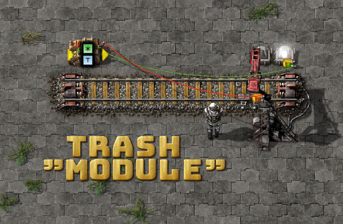
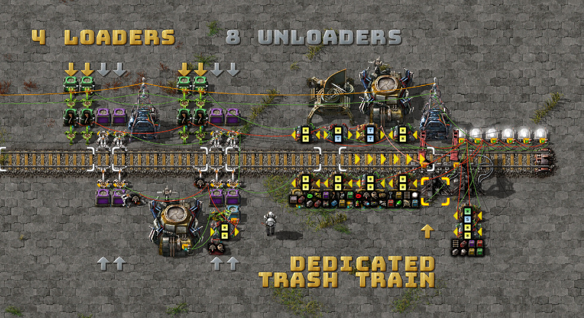
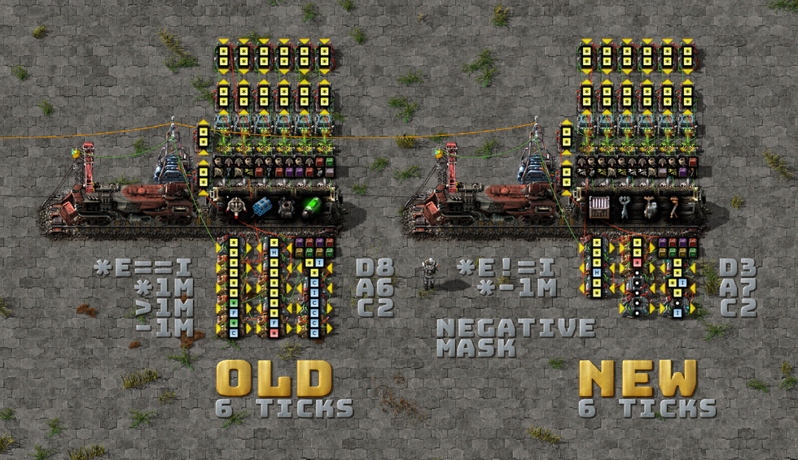
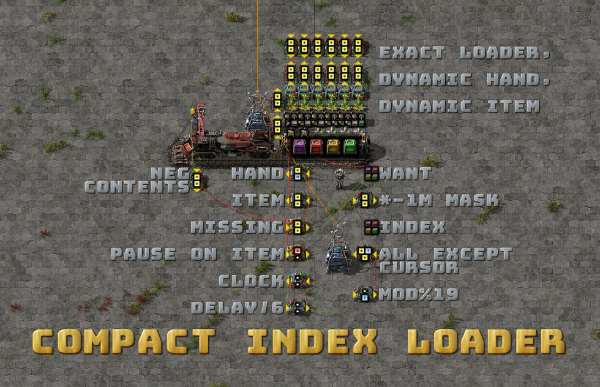
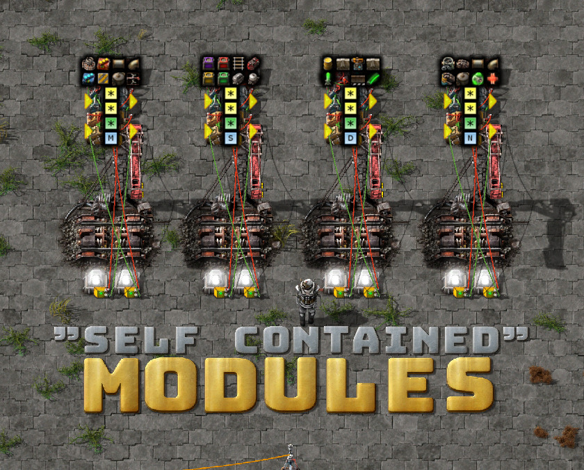
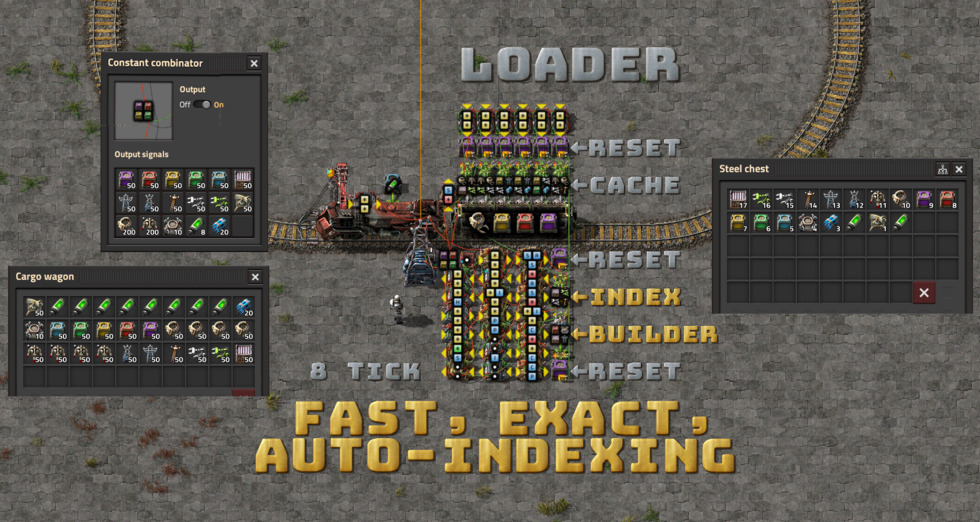
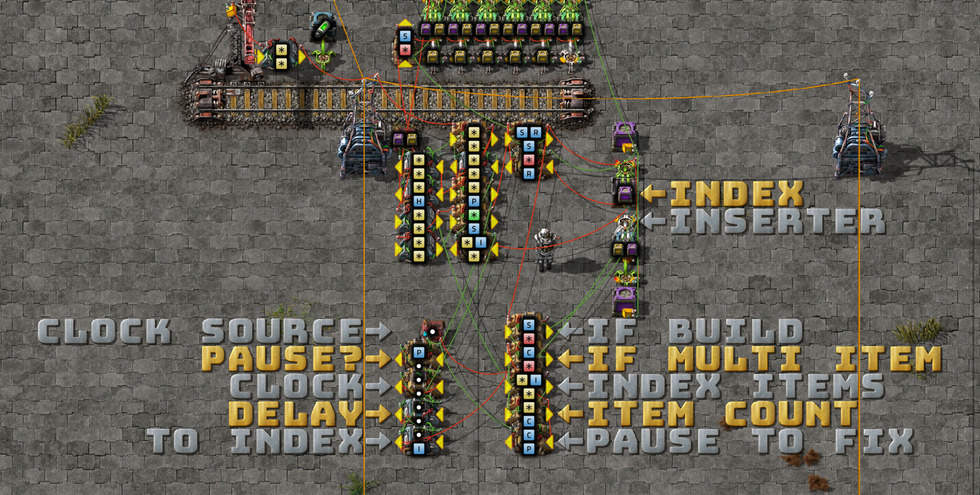
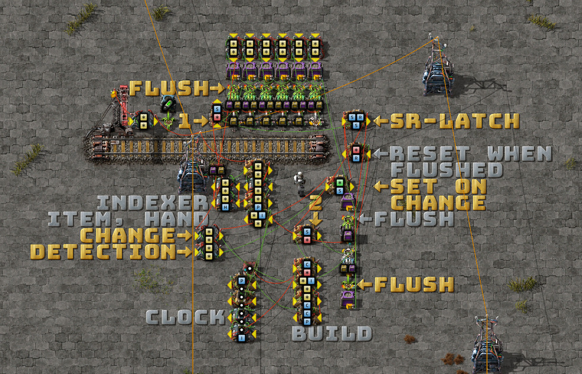
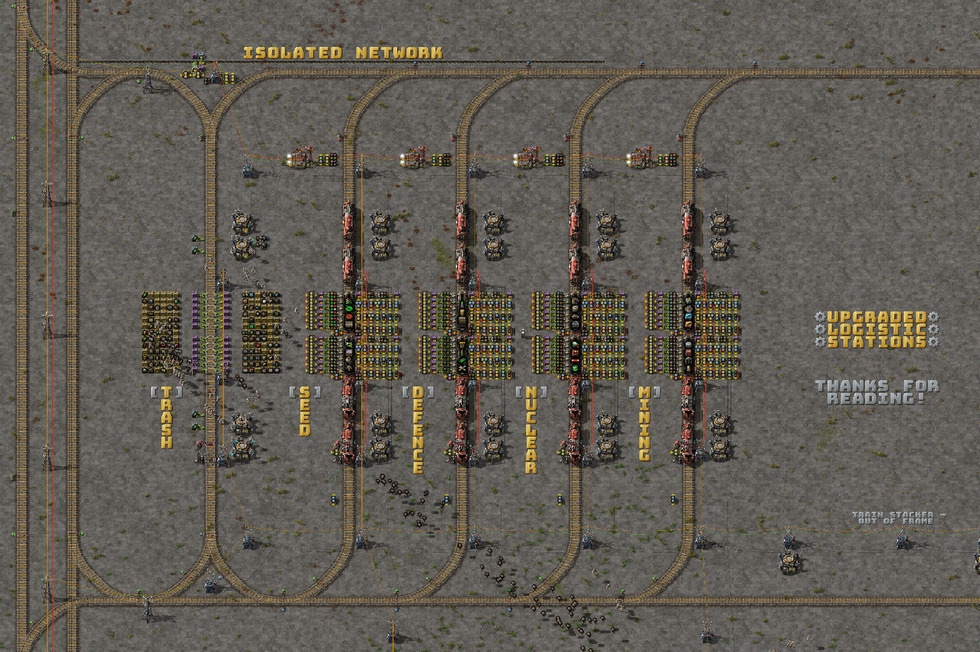

# Logistic Circuits, Part 2: Automatic Indexes, Trash Trains, and Faster Unloaders

This is a continuation of the [first
post](../../../2020/05/23/logistic-train-evolution.md).

Writing the first part of this series has been a very rewarding experience. I'm
re-learning how valuable teaching is for both the writer and the reader.

Revisiting my old circuits to explain how they function has already revealed
many areas for improvement. I made some of those improvements while publishing
Part 1, and I've got a few more to walk through in this post.

## Unloader improvements

Adding a dedicated trash train was long overdue. Previously, the seed train
doubled as my trash train. Over-filling the seed module's manifest would leave
little to no room to return items to base.

During base expansion, I create and destroy many of these logistic stations.
Waiting for stations to deconstruct so I could move the perimeter wall or clean
up my rail network cost me hours of wait time and round trips.

I came up with a partial fix, which I included in the last blueprint book:



This would replace the seed train stop with a dedicated trash train. However,
this worked best when I was destroying an outpost; in other cases, it required
manual fixups. There's no substitute for building this feature directly into the
outpost:



I'm using a new trick here, too: buffer chests to replace the requester and
steel chests. These have a major advantage over the prior setup, as they allow
player logistics, construction robots, and regular logistics (assemblers,
smelters) to pull from the trash chests while a train is en route.

I frequently found that when refactoring outposts, I would flush all my beacons,
modules, and assemblers through the trash circuit. When using requester and
steel chests, I was unable to use those items again until a resupply train
arrived (the trash items would be loaded and then unloaded immediately—still a
PITA).

Using buffer chests in `set-requests` mode is the best of both worlds. It
behaves like a requester chest, it won't pull from other buffer chests, and it
makes itself available to the logistics network.

The trash inserters don't need to overlap with the module slot inserter
alignments, so I found there was room for another four unloaders (from four to
eight).

## Cleaner index circuit

I found a way to shrink the indexer circuit by using a negative mask rather than
the `*1.0M`, `>1.0M`, `-1.0M` trick from the previous post, which removes four
combinators.


> [Blueprint.txt](2020-05-25-old-new-rigs.txt) \
> Install the [Text Plates](https://mods.factorio.com/mod/textplates) mod if
> needed.

I made some concessions, though: the circuit will no longer pause when the train
is fully loaded. This was most annoying when I was standing over it and building
it. Most of the time, I'm elsewhere.

Let's explode the circuit and do a walkthrough:


> [Blueprint.txt](2020-05-25-compact-loader.txt)

There are two changes. The indexer circuit now outputs everything except the
cursor: `[*each] != [I]`. I then use `[*each] * -1.0M` to create a negative mask
that's joined with the `WANT` constant combinator.

The `MISSING` combinator takes three input signals:

*   The `WANT` signal: `{ rail: 100, chest: 50, inserter: 10 }`
*   The negative mask from the indexer: `{ rail: -1M, inserter: -1M }` when
    `chest` is selected.
*   The (negative) train contents: `{ rail: -80, chest: -10 }`

Which sum to: `{ rail: -1M, chest: 40, inserter: -1M }`.

The `MISSING` combinator filters negative values with `[*each] > 0 ->
[*each]`. Now we have an isolated item signal of exactly what's
missing—`{ chest: 40 }`—which is perfect for calculating the filter inserter's
hand size and filter item (`HAND`, `ITEM`).

## Pain Point: Index Management

Index management is a pain. Setting new requests remotely requires a lot of
fiddling to correctly upgrade the manifests and indexes for each loader.



The dream is to plonk down an upgraded, self-contained module at the loader and
unloader and have the circuit make all the necessary adjustments at both ends.

There are at least two missing pieces:

*   Generating an index from the manifest signal automatically. This would also
    ensure the index stays in sync with the manifest's items.
*   Balancing items over multiple wagons (otherwise, we'd be limited to 40 item
    types for the entire train). (Spoiler: I haven't solved this yet.)

## Automatic indexer

Last week, I thought this was impossible—and perhaps it should be. Here is a
compact, fast, exact, auto-indexing logistic loader circuit that also resets the
train loader cache, index, and index builder when the manifest changes.


> [blueprint.txt](2020-05-28-auto-indexer.txt) \
> Top-left is the request manifest (constant combinator). \
> Bottom-left is the exact cargo wagon contents. \
> Right is the index state, built to match the items in the request signal.

I use the steel chest as persistent storage for the index.

The brainwave for this came after I read a [Reddit
comment](https://www.reddit.com/r/factorio/comments/gp1idk/the_evolution_of_my_vanilla_logistic_train/frnfajy/?context=3)
on the first post. I can use a filter inserter to select and isolate a single
item from a mixed-item signal.

Naturally, this will only work for item signals, and you'll need to have those
items in the current logistic network while building the index.

Previously, I thought this would only be possible by using a [Lua
script](https://github.com/technicalfactorio/technicalfactorio/blob/master/combinators/generate_signal_index.lua)
to generate a massive constant combinator array programmed with all the in-game
items. This wouldn't be robust enough for non-vanilla items (without re-running
the script in each context), it has a huge footprint (at least 12 combinators),
and the iteration times over ~250 items to use just 10 of them was very slow.
The manual index was a huge improvement at the time.

### Index building

The procedure is as follows:

*   Iterate over the index range `(1..18)` with `[clock] % 19`.
*   Count the number of item types at the current index position with `[*each] ->
    C: 1`.
*   If multiple items are found (`[C]ount > 1`):
    *   Pause the clock.
    *   Insert one of the items into the chest, which moves it into the next
        slot.
*   Repeat.

Let's simulate it with a bit of Rust:

```rust
fn main() {
    let mut db: std::collections::BTreeMap<char, i32> = ['A', 'B', 'C', 'D', 'E', 'F']
        .iter()
        .map(|&item| (item, 1))
        .collect();
    let mut clock: i32 = 1234;
    loop {
        for (k, v) in &db {
            print!("{}{} ", k, v);
        }
        // convert clock signal into index position
        let index = clock % 19;
        // find items at this index position
        let items: Vec<char> = db
            .iter()
            .filter_map(|(k, v)| if *v == index { Some(*k) } else { None })
            .collect();
        let count = items.len();
        print!("- index: {}", index);
        if count > 0 {
            print!(", items: {}", items.iter().collect::<String>());
        }
        if count > 1 {
            let first = items[0];
            // insert one of the multiple items to move it into the next slot (higher value).
            db.entry(first).and_modify(|e| *e += 1);
            println!(", insert: {}", first);
        } else {
            // resume clock
            clock += 1;
            println!(", resume");
        }

        let mut values: Vec<&i32> = db.values().collect();
        values.sort();
        values.dedup();
        if values.len() == db.len() && count == 0 {
            println!("done!");
            break;
        }
    }
}
```
```
A1 B1 C1 D1 E1 F1 - index: 18, resume
A1 B1 C1 D1 E1 F1 - index: 0, resume
A1 B1 C1 D1 E1 F1 - index: 1, items: ABCDEF, insert: A
A2 B1 C1 D1 E1 F1 - index: 1, items: BCDEF, insert: B
A2 B2 C1 D1 E1 F1 - index: 1, items: CDEF, insert: C
A2 B2 C2 D1 E1 F1 - index: 1, items: DEF, insert: D
A2 B2 C2 D2 E1 F1 - index: 1, items: EF, insert: E
A2 B2 C2 D2 E2 F1 - index: 1, items: F, resume
A2 B2 C2 D2 E2 F1 - index: 2, items: ABCDE, insert: A
A3 B2 C2 D2 E2 F1 - index: 2, items: BCDE, insert: B
A3 B3 C2 D2 E2 F1 - index: 2, items: CDE, insert: C
A3 B3 C3 D2 E2 F1 - index: 2, items: DE, insert: D
A3 B3 C3 D3 E2 F1 - index: 2, items: E, resume
A3 B3 C3 D3 E2 F1 - index: 3, items: ABCD, insert: A
A4 B3 C3 D3 E2 F1 - index: 3, items: BCD, insert: B
A4 B4 C3 D3 E2 F1 - index: 3, items: CD, insert: C
A4 B4 C4 D3 E2 F1 - index: 3, items: D, resume
A4 B4 C4 D3 E2 F1 - index: 4, items: ABC, insert: A
A5 B4 C4 D3 E2 F1 - index: 4, items: BC, insert: B
A5 B5 C4 D3 E2 F1 - index: 4, items: C, resume
A5 B5 C4 D3 E2 F1 - index: 5, items: AB, insert: A
A6 B5 C4 D3 E2 F1 - index: 5, items: B, resume
A6 B5 C4 D3 E2 F1 - index: 6, items: A, resume
A6 B5 C4 D3 E2 F1 - index: 7, resume
done!
```

We've converted our request signal, `A1 B1 C1 D1 E1 F1`, into a unique index, `A6
B5 C4 D3 E2 F1`. Woo!

Let's match this to the circuit:


> [blueprint.txt](2020-05-28-exploded-index-build.txt)

The `CLOCK SOURCE`, `PAUSE?`, `CLOCK`, and `TO INDEX` combinators are familiar
elements from prior circuits.

`INDEX` is the persistent memory where the index is built, and `INSERTER` is how
we shift items up the index slots one by one (hand size: 1).

`IF BUILD` checks if we're in index-building mode; the other mode, `FLUSH`, is
triggered when the constant combinator changes. When triggered, `FLUSH` mode
will flush all caches and chests (train loading cache, index chest, and
requester chest). More on this later.

`INDEX ITEMS` selects all items at the given index position with `[*each] == [I]
-> [*each]: 1`.

`ITEM COUNT` emits `C: 1` for each item found at the current index position. If
`C > 1`, we pause the clock (`PAUSE TO FIX`) while we fix this index position.

`IF MULTI ITEM` sends a signal to the filter inserter and requester chest if `C >
1`.

Now, with what I've explained so far, there's a big off-by-one error. The item
at index position 1 will never be inserted into the chest because of the base
request signal (`{ rail: 1, chest: 1, inserter: 1, ... }`). We need a way to
invalidate the `index=1` position. I did this by reusing the clock source `dot:
1` to occupy that slot and push every other item up a slot. The `dot` signal is
not an item and can't be inserted.

### Flush circuit


> [blueprint.txt](2020-05-28-exploded-flush-circuit.txt)

This is the second circuit mode, which flushes all state after a manifest
change and then allows an index rebuild to start from a known-good state (zero).

The `FLUSH` trigger is a small, three-combinator change-detection circuit. Both
arithmetic combinators do `[*each] ^ 0 -> [*each]` to normalize the request
signals. The output of the first is fed into the second, and then both are fed
into the `SET ON CHANGE` decider with the condition `[*each] != 2 -> S: 1`.

In the steady state, each value in the `SET ON CHANGE` input signal will be `2`
(one from each arithmetic combinator). On changes, there will be a one-tick
memory delay in the circuit, in which one item will read a value of `1`,
triggering `S: 1` and the `SR-LATCH` to start the flush cycle.

The `SR-LATCH`, in the `S > 0` set state, enables the eight inserters that flush
all chests into the active provider chests. The `RESET WHEN FLUSHED` condition
is true when all the active provider chests are empty.

There are two transistors (`1` and `2`) that cut off signals to the requester
chests when `FLUSH` mode is active.

The indexer circuit in the middle remains the same as in the prior circuits.

## Station upgrade

And finally, I upgraded my logistic stations to share the same trash stop with
the trash trains:


> Included in the blueprint book below.

## Blueprint book!

[blueprint-book.txt](2020-05-28-blueprint-book.txt)

I'd love to hear your feedback, corrections, contributions, and fixes!

Email me at mason.larobina@gmail.com or raise an issue on the [GitHub
repo](http://github.com/mason-larobina/factorio).

For updates, star the repo or follow:

https://github.com/mason-larobina/factorio/commits/master.atom
