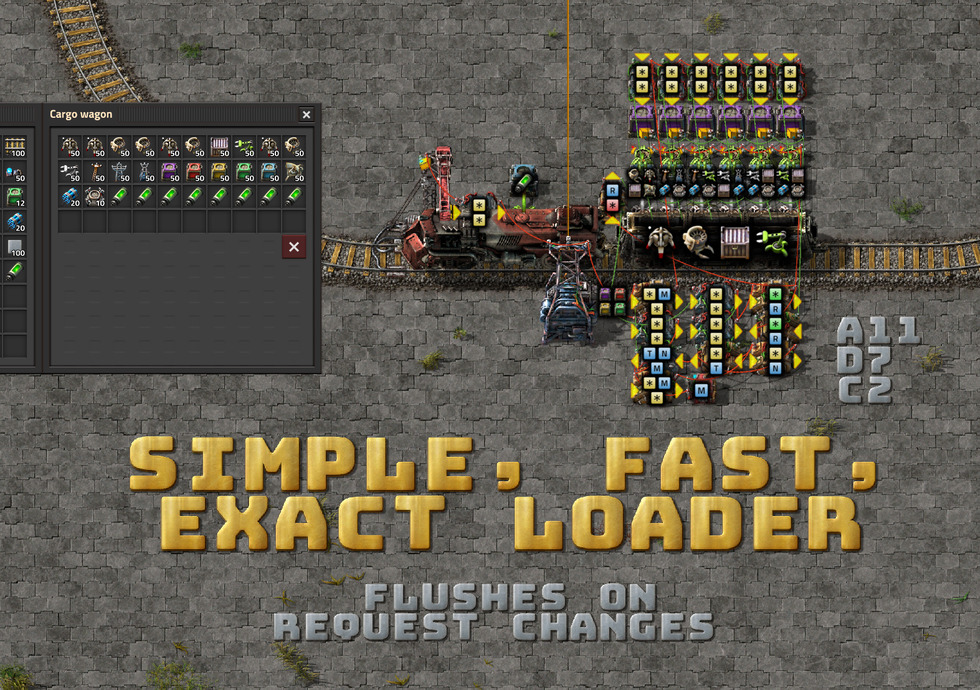
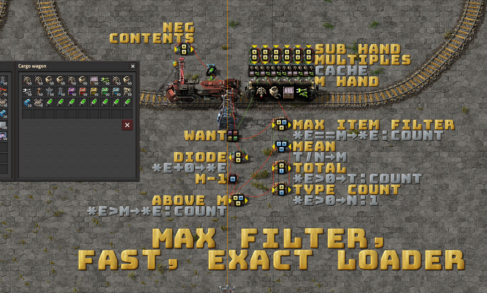
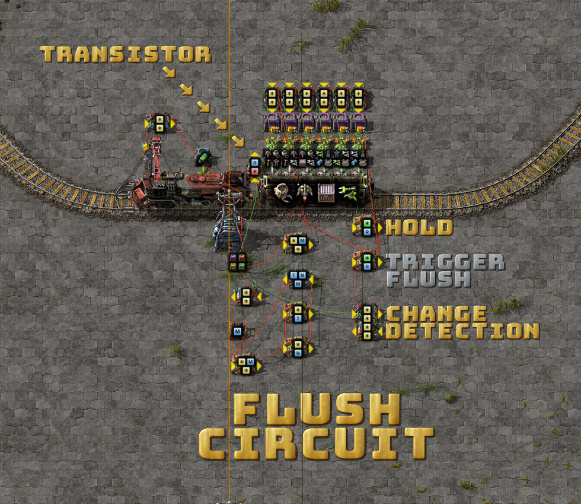
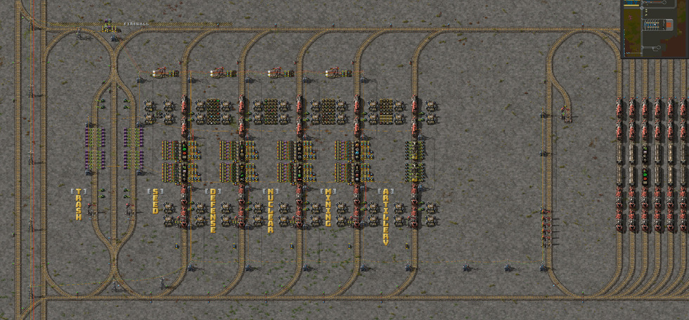
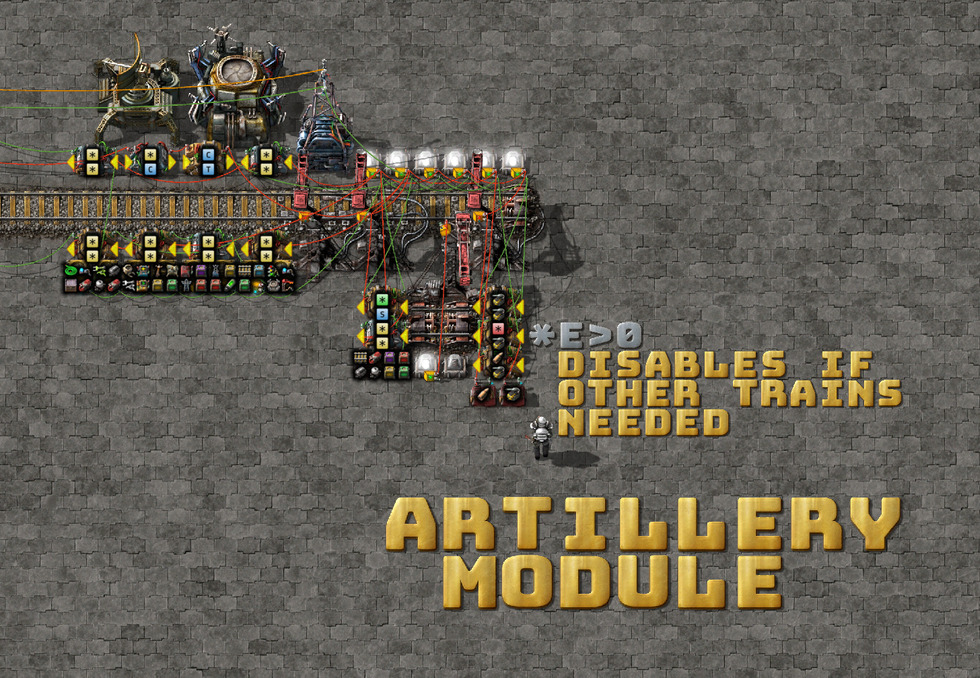
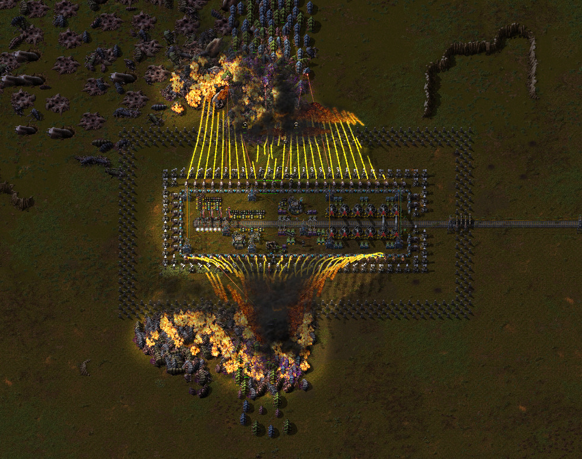

# Logistic Circuits, Part 3: The Max-Filter Loader

Thanks to more discussion on my previous posts, I've been able to make a major
simplification to the loader station.

> I arrived very quickly at the idea that the solution to stack size control
> signals would be to simply always go for the item that has the highest number
> to be moved as this would mean that not only can I use this to filter by
> value, but it's also most efficient in numbers of arm swings. But it took me
> an hour or so to realize one though error - I don't actually have to isolate
> ONE signal out of those, only ALL signals that match the highest value. If I
> need to move 100 rails and 100 belts, I don't care which is moved first,
> right? Just feed them both to the inserter and let it decide. On the next
> swing, the other is going to be the higher value one, so that will be chosen
> by the max value picker, then back again to the previous, and so on. -
> [PaterFrog](https://www.reddit.com/r/technicalfactorio/comments/gs1cfa/logistic_circuits_part_2_automatic_indexes_trash/fs4iwzf/)

Genius. The major insight here is that for the purpose of calculating the
correct hand size, we don't need to process a **single item** at a time; we only
need to process a **single value** at a time. All items with the same value
will have the same hand-size signal. Let the filter inserter handle multiple
items as it normally would.

The indexing system from [Part
1](../23/logistic-train-evolution.md) and [Part
2](../28/logistic-circuits-part-2.md) can be replaced by a circuit that probes
for the maximum item value and then sets the `set-filters` signal to the
matching items. As items are inserted into the train, the max value is reduced,
and so are the `set-filters` and hand signals.


> [blueprint.txt](2020-05-29-simple-exact-loader.txt)

I can calculate the max item in a loop by excluding items below the mean in
successive iterations.

Here's another simulation in Rust:

```rust
fn main() {
    let mut items: Vec<i32> = vec![1, 10, 20, 50, 50, 100, 200];
    let mut mean: i32 = 0;
    while items.len() > 0 {
        let mut sum: i32 = 0;
        let mut count: i32 = 0;
        print!("[ ");
        for value in items.iter().filter(|&&v| v >= mean && v > 0) {
            sum += value;
            count += 1;
            print!("{} ", value);
        }
        print!("]");
        mean = if count > 0 { sum / count } else { 0 };
        print!(", {} / {} = {}", sum, count, mean);
        for v in items.iter_mut().filter(|v| **v == mean) {
            let d = std::cmp::min(12 * 6, *v);
            print!(", insert {}", d);
            // insert this item, 6 inserters.
            *v -= d;
            // one at a time.
            break;
        }
        println!();
        // remove 0's
        items = items.into_iter().filter(|&v| v > 0).collect();
    }
}
```
```
[ 1 10 20 50 50 100 200 ], 431 / 7 = 61
[ 100 200 ], 300 / 2 = 150
[ 200 ], 200 / 1 = 200, insert 72
[ ], 0 / 0 = 0
[ 1 10 20 50 50 100 128 ], 359 / 7 = 51
[ 100 128 ], 228 / 2 = 114
[ 128 ], 128 / 1 = 128, insert 72
[ ], 0 / 0 = 0
[ 1 10 20 50 50 100 56 ], 287 / 7 = 41
[ 50 50 100 56 ], 256 / 4 = 64
[ 100 ], 100 / 1 = 100, insert 72
[ ], 0 / 0 = 0
[ 1 10 20 50 50 28 56 ], 215 / 7 = 30
[ 50 50 56 ], 156 / 3 = 52
[ 56 ], 56 / 1 = 56, insert 56
[ ], 0 / 0 = 0
[ 1 10 20 50 50 28 ], 159 / 6 = 26
[ 50 50 28 ], 128 / 3 = 42
[ 50 50 ], 100 / 2 = 50, insert 50
[ 50 ], 50 / 1 = 50, insert 50
[ ], 0 / 0 = 0
[ 1 10 20 28 ], 59 / 4 = 14
[ 20 28 ], 48 / 2 = 24
[ 28 ], 28 / 1 = 28, insert 28
[ ], 0 / 0 = 0
[ 1 10 20 ], 31 / 3 = 10, insert 10
[ 20 ], 20 / 1 = 20, insert 20
[ ], 0 / 0 = 0
[ 1 ], 1 / 1 = 1, insert 1
```

As you can see, this only takes about three ticks to find a match for each
value, which is much shorter than the ~40 ticks per inserter swing.

Let's see what this looks like in circuit form:


> [blueprint.txt](2020-05-29-exploded-fast-exact-loader.txt)

The filter inserters can use the `M` signal as-is. The `DIODE` allows me to
change the `M` value locally (`M - 1`) without affecting the `MAX ITEM FILTER`'s
match. By reducing the `M` value by one, I can create a filter for `[*anything] >
M`, which excludes the `M` value itself. Otherwise, the equivalent `[*anything] >=
M` would include `M` in the average calculation.

I've simplified the top inserter cache array, thanks to the changes in Factorio
0.18 that increased the buffer and requester chest slots to 30. This is more
than enough to fit the contents of the requester signal, so a row of difference
circuits can be removed.

## Flush circuit

Let's retain the flush functionality from the last few circuits. When I change
the request signal, I want the cache chests to be emptied to make room for the
new items.


> [blueprint.txt](2020-05-29-flush-circuit.txt)

This, too, has been simplified. I've removed the `SR-LATCH` and am instead using
the contents of the active provider chests as the state/memory. The flush
inserters are activated by a one-tick difference-detection circuit, and the
flush state is then held by the contents of the flush chest.

The transistor prevents the new item cache request signals from reaching the
requester chests until the old contents have been removed.

## Upgraded station

The station got an upgrade, too. It has more throughput for unloading and a
bypass lane to the stacker.



## Artillery module!

There's also a new artillery train and module:



With a small change to the outpost station—the inclusion of a diode on the G2
(public green) circuit—this module can now enable itself only if no other trains
are required (for, say, repair packs, walls, or lasers).


With these powers combined, rate-limiting, autonomous extermination outposts are
possible:



I really like that the artillery trains can share the same outpost unloader
circuit, which amplifies their salvo fire rate with additional turrets.

## Blueprint book

[blueprint-book.txt](2020-05-30-blueprint-book.txt)

I'd love to hear your feedback, corrections, contributions, and fixes!

Email me at mason.larobina@gmail.com or raise an issue on the [GitHub
repo](http://github.com/mason-larobina/factorio).

For updates, star the repo or follow:

https://github.com/mason-larobina/factorio/commits/master.atom
