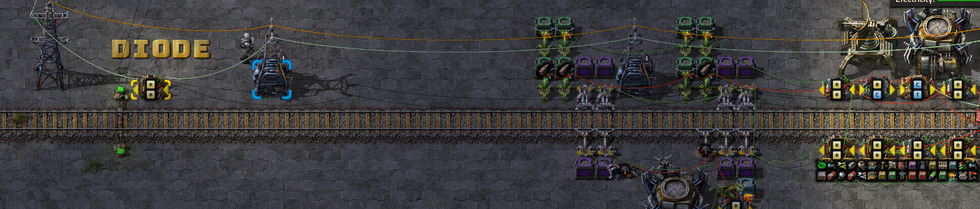

# Logistic Circuits Part 3 - Max filter loader, fixed point reached?

Thanks to even more discussion on the posts over the last week a major
simplification is now possible in the loader station.

> I arrived very quickly at the idea that the solution to stack size control
> signals would be to simply always go for the item that has the highest number
> to be moved as this would mean that not only can I use this to filter by
> value, but it's also most efficient in numbers of arm swings. But it took me
> an hour or so to realize one though error - I don't actually have to isolate
> ONE signal out of those, only ALL signals that match the highest value. If I
> need to move 100 rails and 100 belts, I don't care which is moved first,
> right? Just feed them both to the inserter and let it decide. On the next
> swing, the other is going to be the higher value one, so that will be chosen
> by the max value picker, then back again to the previous, and so on. -
> [PaterFrog](https://www.reddit.com/r/technicalfactorio/comments/gs1cfa/logistic_circuits_part_2_automatic_indexes_trash/fs4iwzf/)

Genius. The major insight here is that for purposes of calculating the correct
hand size, we don't need to process a **single item** at a time. We need only to
process a **single value** at a time. For which, all items with the same value
will have the same hand size signal. Let the filter inserter handle multiple
items normally.

The indexing system (in parts [#1](../23/logistic-train-evolution.md) and
[#2](../28/logistic-circuits-part-2.md)) can be replaced by a circuit that
probes for the max item value and then sets the `set-filters` signal to the
matching items. As items are in inserted into the train the max value reduces
and so does the `set-filters` and hand signals.


> [blueprint.txt](2020-05-29-simple-exact-loader.txt)

Calculating the max item can be done in a loop by excluding items below the mean
in successive iterations.

Another simulation in Rust:

```rust
fn main() {
    let mut items: Vec<i32> = vec![1, 10, 20, 50, 50, 100, 200];
    let mut mean: i32 = 0;
    while items.len() > 0 {
        let mut sum: i32 = 0;
        let mut count: i32 = 0;
        print!("[ ");
        for value in items.iter().filter(|&&v| v >= mean && v > 0) {
            sum += value;
            count += 1;
            print!("{} ", value);
        }
        print!("]");
        mean = if count > 0 { sum / count } else { 0 };
        print!(", {} / {} = {}", sum, count, mean);
        for v in items.iter_mut().filter(|v| **v == mean) {
            let d = std::cmp::min(12 * 6, *v);
            print!(", insert {}", d);
            // insert this item, 6 inserters.
            *v -= d;
            // one at a time.
            break;
        }
        println!();
        // remove 0's
        items = items.into_iter().filter(|&v| v > 0).collect();
    }
}
```
```
[ 1 10 20 50 50 100 200 ], 431 / 7 = 61
[ 100 200 ], 300 / 2 = 150
[ 200 ], 200 / 1 = 200, insert 72
[ ], 0 / 0 = 0
[ 1 10 20 50 50 100 128 ], 359 / 7 = 51
[ 100 128 ], 228 / 2 = 114
[ 128 ], 128 / 1 = 128, insert 72
[ ], 0 / 0 = 0
[ 1 10 20 50 50 100 56 ], 287 / 7 = 41
[ 50 50 100 56 ], 256 / 4 = 64
[ 100 ], 100 / 1 = 100, insert 72
[ ], 0 / 0 = 0
[ 1 10 20 50 50 28 56 ], 215 / 7 = 30
[ 50 50 56 ], 156 / 3 = 52
[ 56 ], 56 / 1 = 56, insert 56
[ ], 0 / 0 = 0
[ 1 10 20 50 50 28 ], 159 / 6 = 26
[ 50 50 28 ], 128 / 3 = 42
[ 50 50 ], 100 / 2 = 50, insert 50
[ 50 ], 50 / 1 = 50, insert 50
[ ], 0 / 0 = 0
[ 1 10 20 28 ], 59 / 4 = 14
[ 20 28 ], 48 / 2 = 24
[ 28 ], 28 / 1 = 28, insert 28
[ ], 0 / 0 = 0
[ 1 10 20 ], 31 / 3 = 10, insert 10
[ 20 ], 20 / 1 = 20, insert 20
[ ], 0 / 0 = 0
[ 1 ], 1 / 1 = 1, insert 1
```

You can see this only takes ~3 ticks to find a match for each value which is
much shorter than the ~40 ticks per inserter swing.

Let's see this in circuit form:


> [blueprint.txt](2020-05-29-exploded-fast-exact-loader.txt)

The filter inserters can use the `M` signal as is. The `DIODE` allows me to
change the `M` value locally (`M - 1`) without impacting the `MAX ITEM FILTER`
match. By reducing the `M` value by one I can do a filter for `[*anything] > M`
which excludes the M value itself. Otherwise the equivalent `[*anything] >= M`
would include `M` in the average calculations.

The top inserter cache array has been simplified thanks to the changes in the
latest 0.18 version which increased the buffer and requester chest slots (up to
30). This more than fits the contents of the requester signal so a row of diff
circuits can be removed.

## Flush circuit

Let's retain the flush functionality added to the last few circuits. When I make
request signal changes I want the cache chests to be emptied so that there is
room of for the new cache items.


> [blueprint.txt](2020-05-29-flush-circuit.txt)

This too has been simplified. I've removed the `SR-LATCH` and instead using the
contents of the active provider chests as the state/memory. The flush inserters
are only activated by the one-tick diff-detection circuit and then the flush
state is held on by the flush chest contents.

The transistor will prevent the new item cache request signals hitting the
requester chests until the old contents have been removed.

## Upgraded station

The station got an upgrade too. There's more throughput for unloading and a
bypass lane to go into the stacker.


## Artillery module!

There's also a new artillery train and artillery module:


With a small change to the outpost station to include a diode on the G2 (public
green) circuit, this module can now only enable itself if no other trains are
required (for say, repair packs, walls, lasers).



With these powers combined, rate-limiting, autonomous extermination outposts are
now possible:


I really like that the artillery trains can share the same outpost unloader
circuit to amplify the salvo fire rate with additional turrets.

## Blueprint book

[blueprint-book.txt](2020-05-30-blueprint-book.txt)

## That's all for now!

Would love you hear your feedback, corrections, contributions & fixes!

Email: mason.larobina@gmail.com or raise an issue on the [GitHub
repo](http://github.com/mason-larobina/factorio).

For updates, star the repo or follow:

https://github.com/mason-larobina/factorio/commits/master.atom
