> **Note:** This post describes complex workarounds for challenges that have been addressed by quality of life features in Factorio. For a detailed look at these improvements, see my new post: [A Thank You to the Factorio Devs: An End to Complex Workarounds](/factorio/2025/08/07/factorio-qol-improvements.html).

# Logistic Circuits Part 4 - Outpost refinements, self-contained modules

A major annoyance remains after the improvements in [parts 1, 2, and 3](../../../).

To change or upgrade each of the logistic modules, I have to update three separate locations:

1. The station-wide buffer/request circuit (I run all the logistic stations as an isolated bot network so that science packs don't devour my rails and furnaces).
1. The loader circuit for the first wagon.
1. The loader circuit for the second wagon.

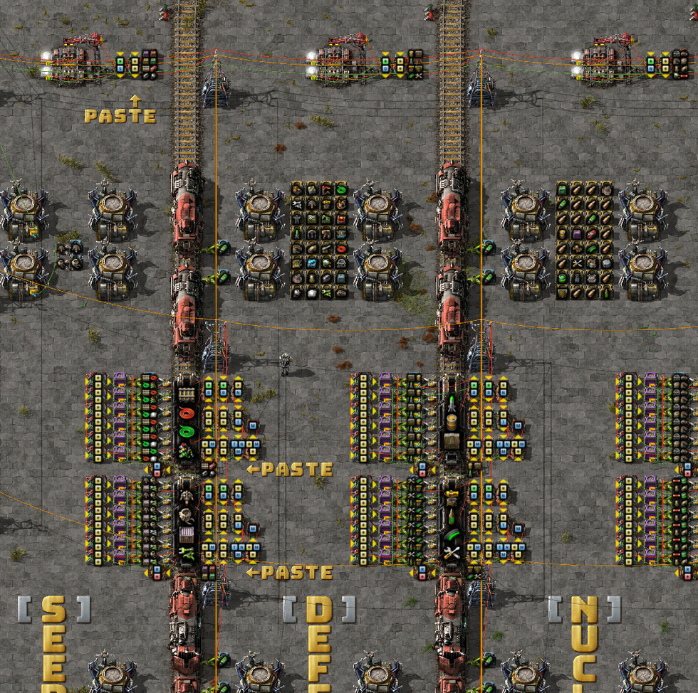

Ideally, I could just plonk down a new module and have all three signals update automatically. I can't do this because of a poor design choice I made when creating the first module. Let's take a closer look:

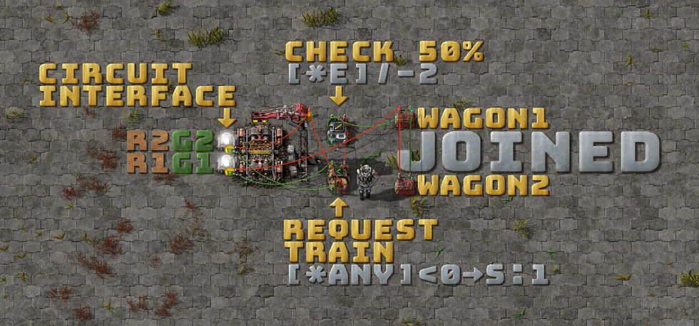

See how both constant combinators are joined on both the red (`1`) and the green (`CHECK 50%`) circuits? This setup prevents the station from processing each constant combinator separately for each wagon.

The first step to fixing this is to feed both constant combinators into another combinator via separate red and green connections:

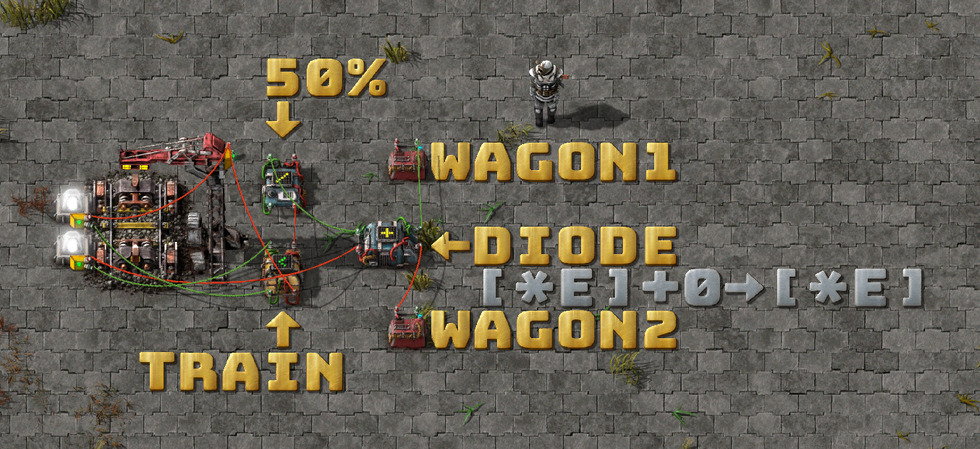

But adding more components to the module increases the width of the outpost station to 13 tiles:

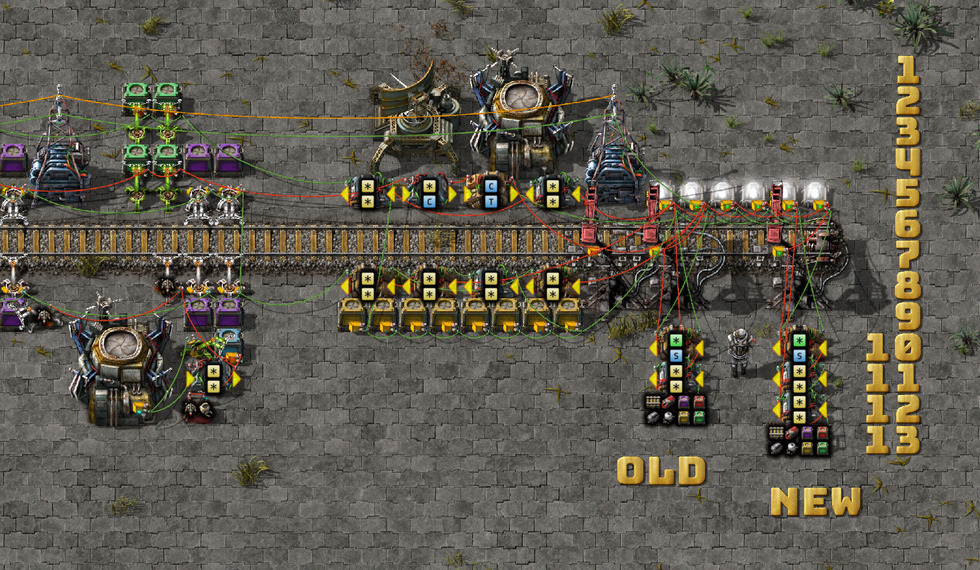

I briefly considered moving some components into the unused space above the lights:

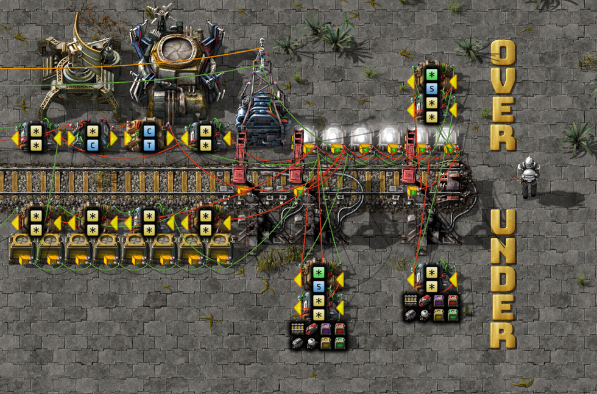

This has its own annoyances, too: I can no longer deconstruct a module with a single drag (`Alt+D`).

What if it's possible to reduce the size of the modules instead? Each module has several common elements:

- Requesting the train
- The 50% check
- The diode
- The constant combinators

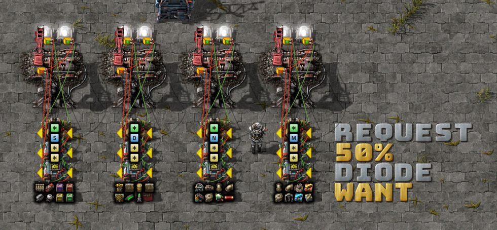

I can also perform the 50% stock check by doubling the outpost's contents signal on the circuit interface. This changes the calculation from `have - (want / 2) < 0` to `(2 * have) - want < 0`.

Keeping `[*each] / -2` from the prior circuit would have perpetuated a bug where `{ car: 1, fuel: 1 }` would be rounded down to `0`. The `want * -1` is subtracted from the `2 * have`. Any negative values enable the train request.

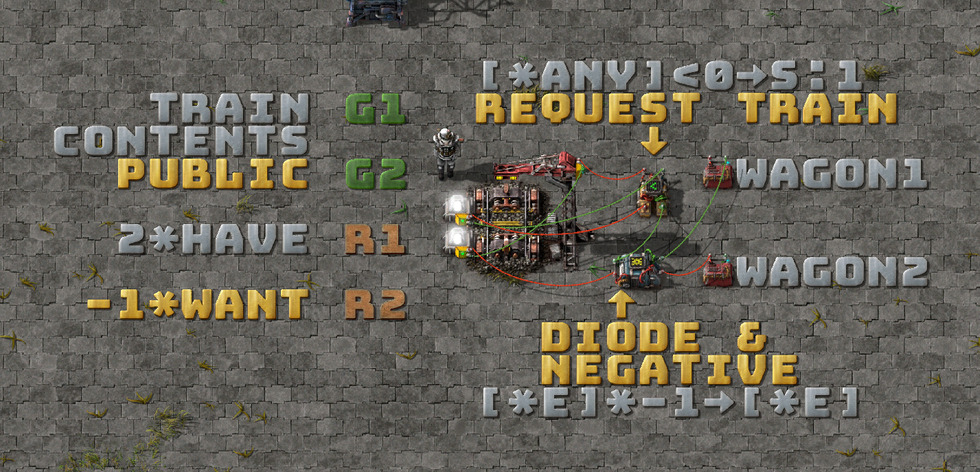

Here's the refactored outpost with the new circuit interface:

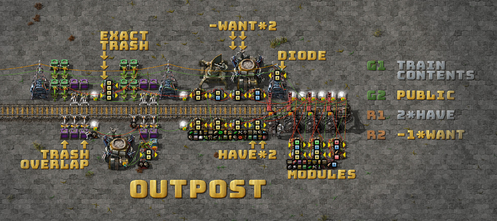

> [blueprint.txt](2020-06-01-new-outpost.txt)

The `have * 2` combinator doubles the logistic chest contents. The `-want * 2` combinator at the top is for the 200% threshold of the trash circuit. The default outpost thresholds are to restock if an item is at `<50%` and trash it if it's at `>200%`.

On the topic of the trash circuit, I added two more combinators to handle rounding problems for `<4` items (`EXACT TRASH`).

The rightmost trash chest takes the full, raw trash signal. The two additional combinators take that signal and do the following:

- `[*each] / 4`: Spreads the load across all four chests (rounds down for `<4`).
- `[*each] * -3`: Corrects the signal on the rightmost chest (equivalent to -75%).

Anything `<4` will land in the rightmost chest. Anything `>4` will be spread evenly across the four chests.

Another change on the bottom left adds a fifth unloader. This creates an overlap with both wagons on the trash train. While changing from requester to buffer chests made trash items available to the logistic network, they wouldn't be moved back into storage. Without any unloader overlap with both trash wagons, those items would have to round-trip through the logistic trains. One unloader is slow, but it's also a rare edge case. You can increase the number of unloaders if needed.

The final change is that I moved the public green diode from the end of the station (offscreen to the left) to a spot near the circuit interface. I embed the outpost station into many other contraptions, and sometimes the entrance is curved. It's easier to adjust the system if the components are densely packed into a smaller footprint.

## Loader improvements

With the module improvements, I now have a trivial way to connect the two module constant combinators to the two wagon-loading circuits with red and green wires:

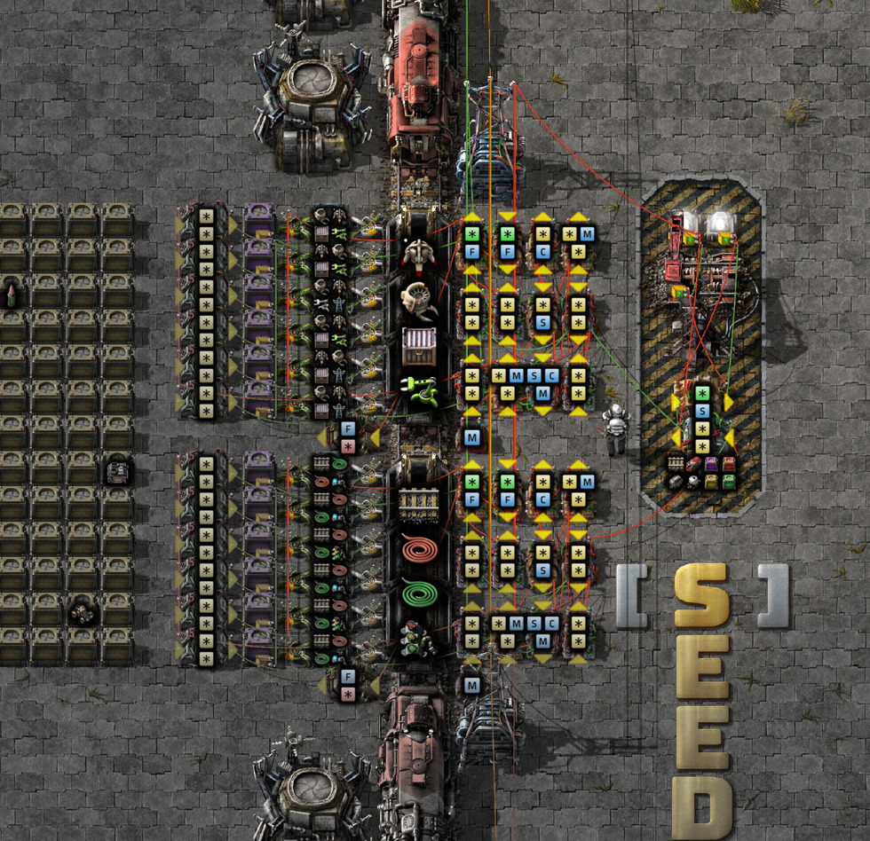

The combined (negative) request signal goes into the station's buffer system.

Now, the upgrade flow is:

1. Make adjustments in the field.
1. Copy-paste the changes onto the station module (and remember that the flush circuit will reset the buffer chests when it detects changes).

The dream of self-contained, multi-purpose modules that I can use at both the outpost and the station is finally a reality!

## Depot improvements

I've been experimenting with some new station designs. I think I prefer this one over the previous iteration, but I may still move the trash train to the left, with the train stacker:

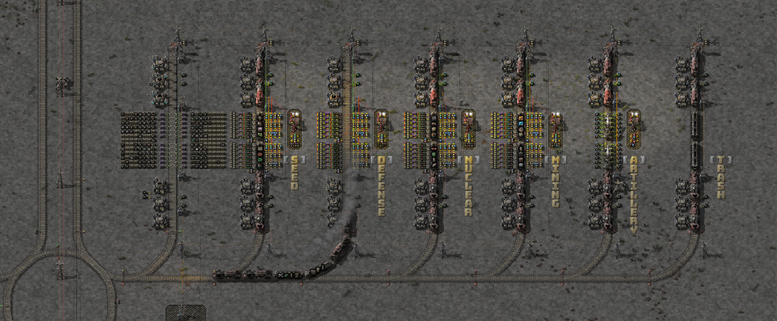 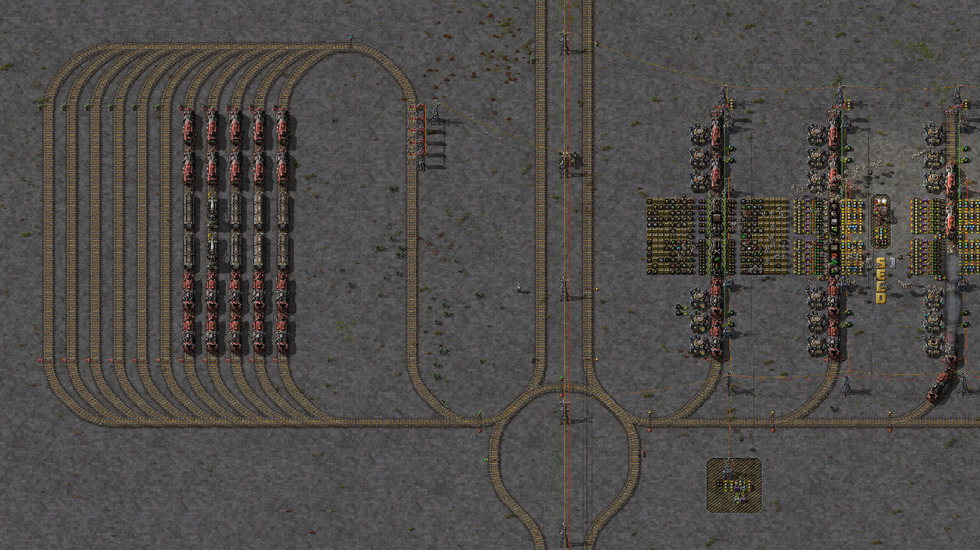

This allows me to add new station types on the right and more room for trains on the left without the two colliding.

I'm also experimenting with a loop junction and some two-way track, which forces all logistic trains to loop through (and wait in) the stacker on their way to the loading stations.

The tiny circuit in the bottom right is the buffer circuit, which requests items from the main logistic network (request if `<10x`, trash if `>20x`).

## Blueprints

This blueprint book contains the latest outpost, depot, module, and train blueprints:

[blueprint-book.txt](2020-06-01-blueprint-book.txt)

It should work out of the box (but you'll need a quasi-global green rail circuit network)!

## Contact

I'd love to hear your feedback, corrections, contributions, and fixes!

Email me at mason.larobina@gmail.com or raise an issue on the [GitHub repo](http://github.com/mason-larobina/factorio).

For updates, star the repo or follow:

https://github.com/mason-larobina/factorio/commits/master.atom
