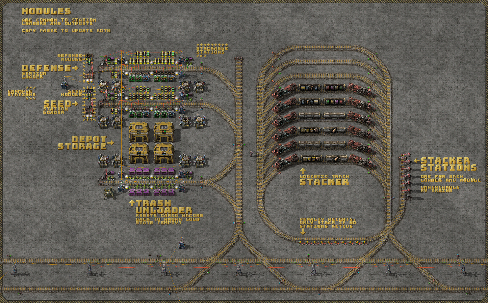
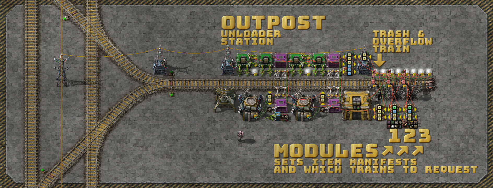
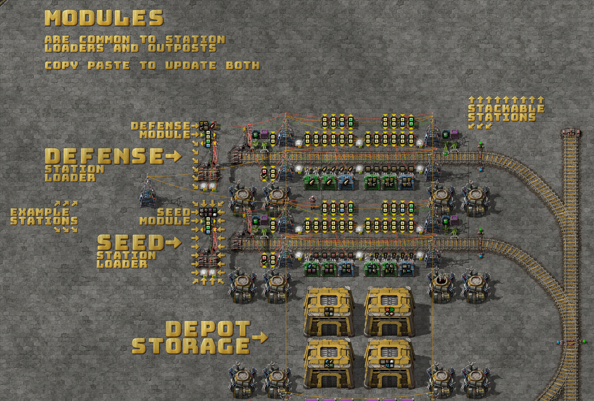
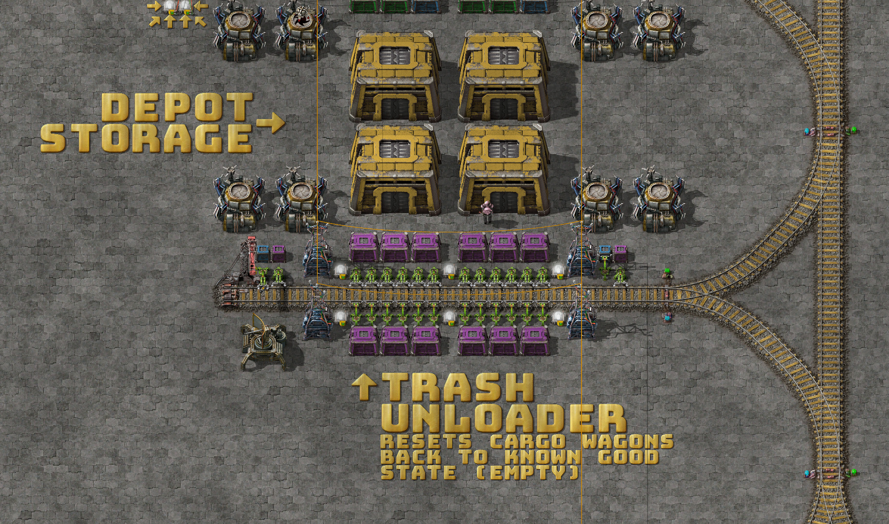
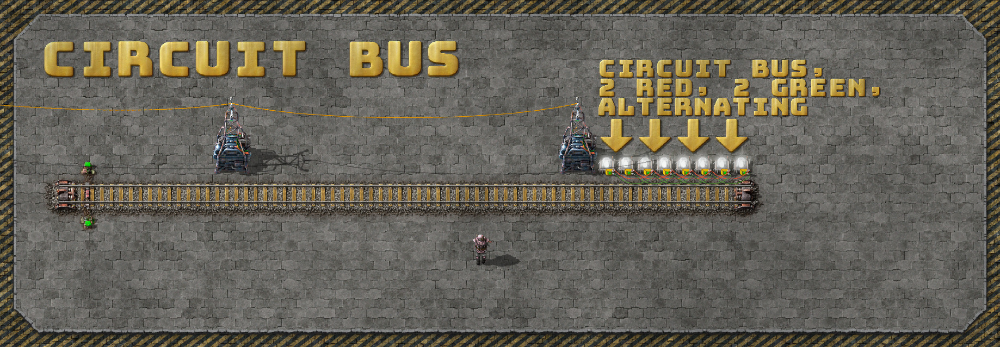
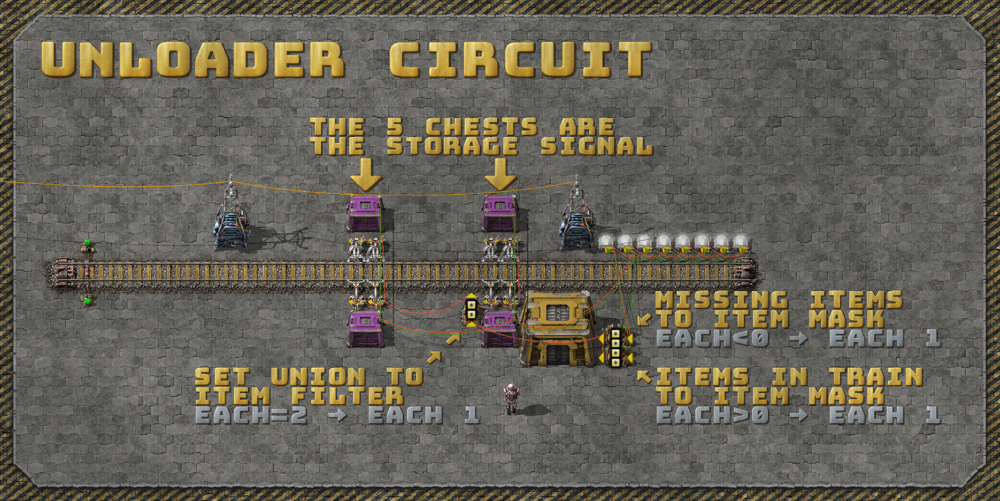
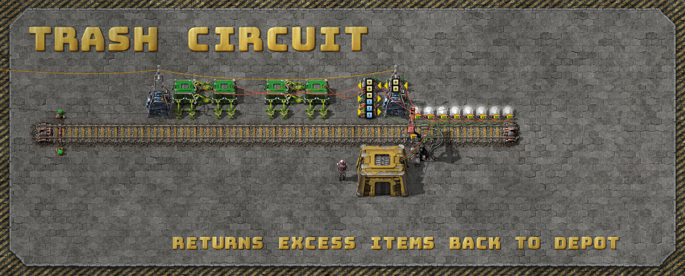
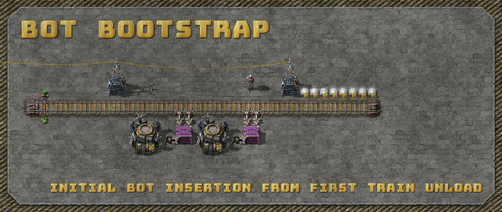
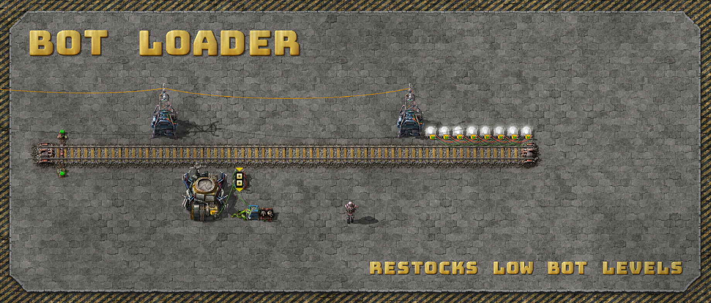
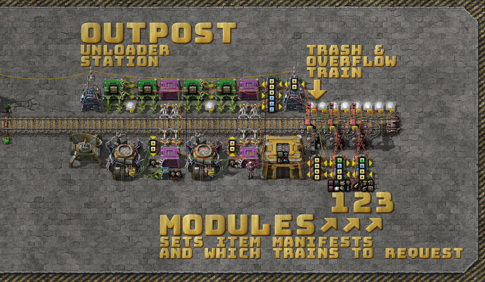

# Logistic Train Upgrades For Factorio v1.1

It's been a while folks! I can't believe how easily two years have passed since
my [last posts](https://mason-larobina.github.io/factorio/). Thank you for
sharing the links around and the comments received. I hope I inspired you to
dig deeper into circuits for factory automation and logistics.

At long last (and by popular request) I'm doing a writeup on my logistic train
upgrades for Factorio v1.1 which added two massive quality of life features:

* Train limits - removing the need for a global circuit network.
* The `Anything` signal outputs - greatly simplifying the train loader circuit.

## Mods

Since the prior blog posts I've been playing a mixture of Krastorio 2 and Space
Exploration which add extreme depth and complexity to the game (to my delight
and occasional frustration).

As a result the screenshots, blueprints and sandbox save-file below need at
least the [AAI Containers](https://mods.factorio.com/mod/aai-containers) mod
installed.

At one point I had a completely vanilla (and less compact) version of the
Factorio v1.1 circuits which you should be able to find in the revision history
for [this
gist](https://gist.github.com/mason-larobina/68389bbf2fa9ee4d764ae58c4a443f8a).

## Overview

The logistic depot consists of 4 main pieces:

* The depot storage which is close to both the trash unloader and the loading
  stations (minimising the [bandwidth delay
  product](https://en.wikipedia.org/wiki/Bandwidth-delay_product) between the
  two).
* The trash unloader which resets all trains back to a known good state (empty)
  to avoid the item fragmentation problems discussed in the prior posts.
* A logistic module, loading station and train for each train type (e.g. seed
  train, defense train, nuclear train, mining train, etc).
* A stacker with dummy stations to enqueue all pending incoming and outgoing
  logistic trains, allowing multiple trains per station and avoiding deadlocks
  over the shared stations.

Thanks to the AAI Containers mod and Factorio v1.1 the logistic outpost is more
compact and contains many features (some the same, some new, some improved):

* Bootstraps logistic bots automatically from either of the seed train wagons.
* Re-fills lost or low bots up to the configured set-points for each.
* Three module slots for three logistic train types (manifests) per outpost.
* Dedicated trash train station to return unwanted or overstocked items back to
  the logistic depot.
* The trash loaders overlap with most of the module stations minimising
  unnecessary trash train call-outs.
* Unloads and loads 96 items per swing (stack size permitting of course).
* Station train limits prevent a thundering herd of trains of the same type to
  each outpost.
* No global circuit network needed.

## Logistic Loading Stations

The stations are greatly simplified after the `Anything` signal output was
added in Factorio v1.1 which removes the need for an index or max-signal based
item filter for exact insertion. The problem and prior solutions are detailed
in depth in the prior 4 blog posts.

Now the circuit becomes a simple difference calculation then a `Anything`
output to do exact insertion on one item type and count at a time.

The two constant combinators in the logistic modules map to two independent
loading circuits in the logistic station, connected and separated by the green
and red wires.

Another trick here is the use of requester chests and buffer chests so that if
stock levels are running low the items are re-shuffled into the requester
chests so that trains aren't stalled waiting for the low stock items to be
returned or produced.

Keep stacking stations for each logistic train type.

## Shared Trash And Storage

Common to all trains and resets the wagons back to a known good state to
prevent problems with item fragmentation.

Factorio signals are unable to differentiate between a single stack of items
(e.g. `{ rails: 100 }`) and several fragmented, partial stacks of items that
total that same amount.

## Logistic Outpost

The outpost may appear complex but is actually composed of several smaller,
simpler, independent circuits that work together to provide the features above.
I'll break them down layer by layer for analysis and explanation.

### The Circuit Bus & Module Interface

This is the connection interface between the modules and station. There are 4
pairs of lamps connected by green and red wires. The station connects to the
left-most pair of lamps and the 3 modules connect to the remaining pairs.

### Unloader Circuit

The unloader circuit subtracts the module request signal from the logistic
module from the station storage. The logistic modules are not pictured here but
can be seen in the above sections and are described in detail in the prior
posts. The modules put a negative request signal on to the bus which is used
above.

Items with a negative quantity are turned into an item mask with `each < 0` and
output `each 1`.

The train contents are turned into a mask with `each > 0` and output `each 1`.

When you combine these masks you can do a set union by checking for `each = 2`
and output `each 1`.

The result sets the filter inserter items.

### Trash Circuit

This doubles the negative module request signal and subtracts it from the
station storage.

The positive item results are then requested to the left buffer chest for each
wagon.

The right buffer chests are used to count the number of trashed items, when it
reaches some threshold (e.g. `T >= 200`) the trash train is called.

Remember that there is no way to set requests and count items in a chest at the
same time.

To double the loading throughput the inserters between the buffer chests are on
their own smaller circuits with a `each < 100` condition.

### Bot Bootstrap

Bootstrap the initial logistic bots from either wagon of the seed train.

### Bot Loader

A simple difference circuit looks at a combinator with the bot set-points (e.g.
`{ logistic: 100, construction: 100 }` and subtracts the current bot counts.

The result is used to set requests on the requester chest.

### Combined Again And Close Up

## Blueprints

You can download the logistic train blueprint book [here](blueprint.txt).

And a simple rail blueprint book [here](rails.txt).

## Sandbox Download

The screenshots from this post are from a sandbox world I used to demonstrate
and explain the updated logistic train circuits.

You can download it [here](sandbox.zip) and play with it yourself.

## Bugs & Feedback

Please raise an issue [here](http://github.com/mason-larobina/factorio) for any
corrections or improvements.

## Update: Vanilla Blueprints & Sandbox

Vanilla blueprints can be found [here](vanilla-blueprint.txt) and the sandbox [here](vanilla-sandbox.zip).

## Discussion

In [/r/factorio](https://www.reddit.com/r/factorio/comments/v5weot/logistic_train_upgrades_for_factorio_v11_part_5/) and [/r/technicalfactorio](https://www.reddit.com/r/technicalfactorio/comments/v5yc5w/logistic_train_upgrades_for_factorio_v11_part_5/).

Enjoy!  😁
