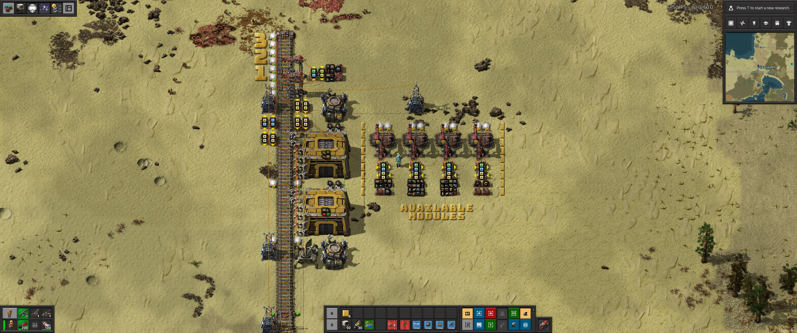

> **Note:** This post describes complex workarounds for challenges that have been addressed by quality of life features in Factorio. For a detailed look at these improvements, see my new post: [A Thank You to the Factorio Devs: An End to Complex Workarounds](/factorio/2025/08/07/factorio-qol-improvements.html).

Previous posts:

- [2020-05-23 - My Factorio Logistic Train Evolution](/factorio/2020/05/23/logistic-train-evolution.html)
- [2020-05-28 - Logistic Circuits Part 2 - Automatic indexes, trash trains, faster unloaders](/factorio/2020/05/28/logistic-circuits-part-2.html)
- [2020-05-30 - Logistic Circuits Part 3 - Max filter loader, fixed point reached?](/factorio/2020/05/30/max-filter-fast-exact-loader.html)
- [2020-06-01 - Logistic Circuits Part 4 - Outpost refinements, self-contained modules](/factorio/2020/06/01/self-contained-modules.html)
- [2022-06-06 - Logistic Circuits Part 5 - Upgrades for Factorio v1.1](/factorio/2022/06/06/upgrades-for-factorio-1-1.html)

# Logistic Trains Without Logistic Bots

Hello again! It's been a while since my last post. In that time, I've played a few more [Space Exploration](https://mods.factorio.com/mod/space-exploration) (SE) games.

A problem I keep encountering in SE is the massive gap between unlocking basic bots and unlocking logistic bots, which renders the logistic train circuits from my prior posts useless. Because I had already "solved" end-game logistic train circuits, I kept trying to push through this gap without a mid-game solution, but with little success.

It's difficult to go back to a pre-logistic-train solution, with all its associated problems, limitations, and annoyances. After much experimentation, I've adapted the end-game logistic train circuits to work without logistic bots. I find it works very well, though its throughput is limited compared to the logistic-bot-and-requester-chest equivalent. When I unlock logistic bots, I'll switch back to requester chests.

Here's a preview of the finished depot, with the loading stations for each logistic train type:

And the unloading station that supports up to 3 logistic train modules:

They can be upgraded to their end-game forms independently; the modules and trains are common to both mid-game and end-game circuits.

## The Loading Stations

The "SEED MODULE" in the top-left is a train station with combinators that define the logistic module for the seed train. I copy this module between the loader and unloader stations. It has a red and a green side. Two constant combinators per side allow for up to 40 unique items per wagon, matching the 40 slots in a cargo wagon. The red and green manifest signals are routed to the lower substation's red and green wires, which in turn signal the buffer chest and loader circuits.

The lower loader circuits, detailed in prior posts, perform exact insertion using a hand-size signal and an item set-filter signal sent to the inserters.

The buffer chest circuit, located above the loader, inserts target items into the buffer chests when it finds them on the nearby belts.

I set the target level in the buffer chests to a small multiple of the manifest signals (x4). This ensures that a few trains can be loaded in quick succession before the slower replenishment from shared depot storage, which is limited to the throughput of a single belt and the time it takes to switch between item types, can catch up.

If the buffer circuit detects missing items, it sends a green signal to the depot storage, requesting that the ring-belt around the storage warehouses be filled with the target items. A pair of whitelist and blacklist inserters on each storage warehouse add and remove items from the shared ring belt, one item type at a time, until the buffer for that item is filled.

This image shows the storage-to-station interface in more detail. The top two arithmetic combinators act as a diode, preventing station signals from mixing with the aggregate depot signals. The third combinator puts the missing (requested) items onto the green storage wire.

I use the depot signal to set the target item level in the shared storage warehouses. Missing items are made-to-order in the mall (pictured elsewhere) via the red signal.

This belt from storage to the buffer wagons is also very important, as it helps reduce the number of item switches on the storage warehouse ring belt. It takes about 10 seconds for a requested item to appear and saturate the storage ring belt. If the system requests 80 item types, it would take a minimum of 800 seconds (10 seconds * 80 items) to refill the buffers. However, if you do more work per item switch, you'll need to switch less often.

The seed train, for example, is configured with a diverse set of common items (inserters, chests, power poles, bots, etc.). The ~30-belt delay between an item entering the station circuit and arriving at the buffer chest allows up to 240 additional items to be buffered during a context switch. For some items and trains, this might mean re-loading only every fourth or fifth train.

You can increase the minimum work per item switch by lengthening the belt and increasing the delay between the storage and buffer chests, assuming you have enough available slots in your buffer chests.

The trash station is shared between all logistic trains and resets them to a known-good state (empty). It converts some items (wood, coal) to fuel for the logistic trains and re-fills others (barrels) with oil for the flamethrower turrets at the wall.

The "RED MISSING ITEMS" display shows the simple difference circuit that requests new items from the mall.

This is my mall, which creates the missing/requested items for the logistic depot.

The depot supports multiple logistic train types. In this playthrough, I have a "seed" train with generic common items, an "outpost" train with mining and factory items, a "wall" train with defensive items, and a "raid" train for taking out biter nests.

The module and loader station are customized for each train type; the rest of the system is common.

## The Unloader Stations

This is the unloader station, with room for three modules (or train types). Items are unloaded directly into storage chests, and trash items are loaded back into the trains from storage.

Because my trains are unidirectional, I can't guarantee their arrival orientation. Therefore, I move construction and logistic bots from the lower to the upper storage chest to bootstrap the bot network.

This image shows that after I placed the seed module, the station detected that it was missing seed items, dispatched the seed train, and is now unloading it.

Compared to the stations in my prior posts, I've updated the thresholds to:

1. Request a train if an item count is below 100% of the target.
1. Unload items up to 200% of the target.
1. Request a trash train for items above 300% of the target or for any unknown items.

Previously, I requested trains at \<100% and >200%, but I found this to be too sensitive. It was common for a full train to be dispatched to replenish just a few items (like chests, wire, or jetpack fuel), representing only 5-10% of the total request. Now, the system refills at least one full item type per train dispatch.

## Save File

If you want to see it in action, I've uploaded my current save game. You'll see that I've massively overbuilt on Nauvis and haven't even launched my first rocket at 120 hours in. I've been having too much fun working on logistic trains instead.

- [2024-02-04-mason-se.zip](2024-02-04-mason-se.zip)

Go to one of the wall stations and start building, or add and remove modules from the station to see the depot and trains do their dance.

I'm not providing blueprints for now, as it should be simple enough to copy what you need from the save game. You can find my rail blueprints in prior posts.

## Bugs & Feedback

Please raise an issue [here](http://github.com/mason-larobina/factorio) or email mason.larobina@pm.me for any corrections or improvements.

## Discussion

- [/r/factorio](https://www.reddit.com/r/factorio/comments/1ail40w/logistic_trains_without_logistic_bots_part_6/)
- [/r/technicalfactorio](https://www.reddit.com/r/technicalfactorio/comments/1ail4zg/logistic_trains_without_logistic_bots_part_6/)

Enjoy! 😁
