# Space Age Logistic Trains

Another year, another major Factorio update and a new blog post (Oops). I've played two Space Age save games since then, each 250 hours or so. An amazing improvement and addition to the base game.

Space Age brought quality items, new planets with unique logistics challenges, and circuit network improvements that required rethinking parts of my system. The introduction of legendary inserters operating faster than signal propagation and quality-tiered bots needed significant refactoring.

This write-up is a continuation and refinement of the vanilla logistic train system that I've been using and writing about for 6 years.

## Who Is It For

This system requires logistic bots to be unlocked, as the outpost stations and loading stations rely on logistic network requests to manage item delivery and trash removal.

The game style I prefer is to have many small logistic networks each covering a small or defined area rather than one large logistic network. Smaller networks have the advantage of improving the throughput of each by limiting how far each bot has to travel (in other words: the bot bandwidth delay product). The high volume of items in or out of an area is done via train. Obviously the module manifest items and quantities should approximately match the relative proportion in which they are consumed/placed.

Also, train systems are fun.

## What Is It

This system manages the automatic item, bot, and trash logistics of remote logistic networks through a shared train network. Outpost stations request items and remove trash; loading stations fulfill those requests from a central supply; modules define what each outpost needs.

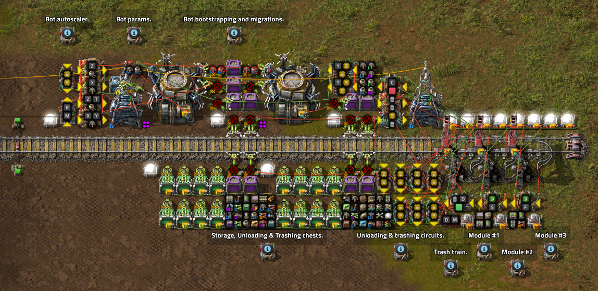

The logistic train system consists of several parts:

- A loading station for each train type (e.g. common items, wall defense items, factory items)
- Train group for each train type.
- A module for each train type.
- An outpost station to request or trash items based on the modules present.
- A trash station to unload each train into the main logistic network near the loading stations.
- A dedicated trash train group for large trash events (deconstructions, removing modules, etc).

[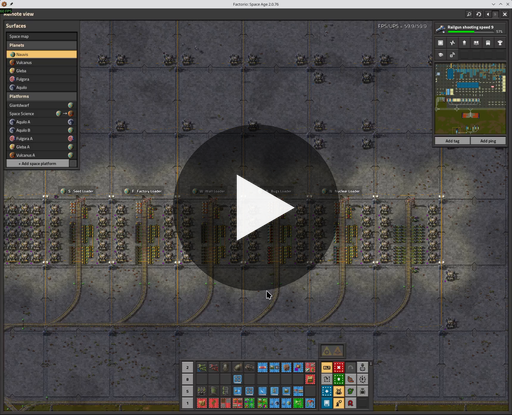](logistic-network-overview.mp4)

In the video:
- the logistic train trash and loading area in my main base
- a factory outpost covering 8x train based factory areas and a train stacker
- a wall outpost covering the west vertical base wall

## Modules

Item stock levels at each outpost are set by modules placed in its 3 module slots. A module is a train stop for that logistic train type paired with an item manifest signal. The manifest (combinator signal group) is shared with the loading station, so changes propagate to all outposts with that module automatically.

Typically these are for base wall defense, mining outposts, factory areas, bug breeders, power plants, etc.

### Seed (Common) Module

This is my current common items module and item manifest. This evolves through the game as new items are unlocked and when new tiers of items become available and abundant.

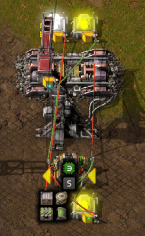
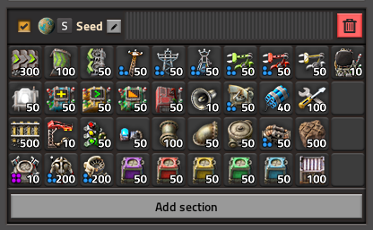

### Factory Module
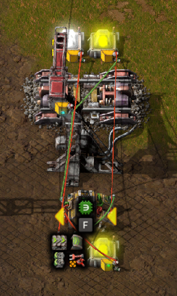
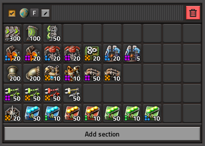

### Wall Module
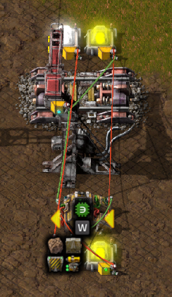
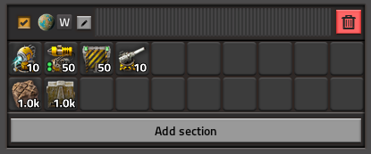

## The Outpost

Let's start with the outpost station, which has seen the most significant changes.

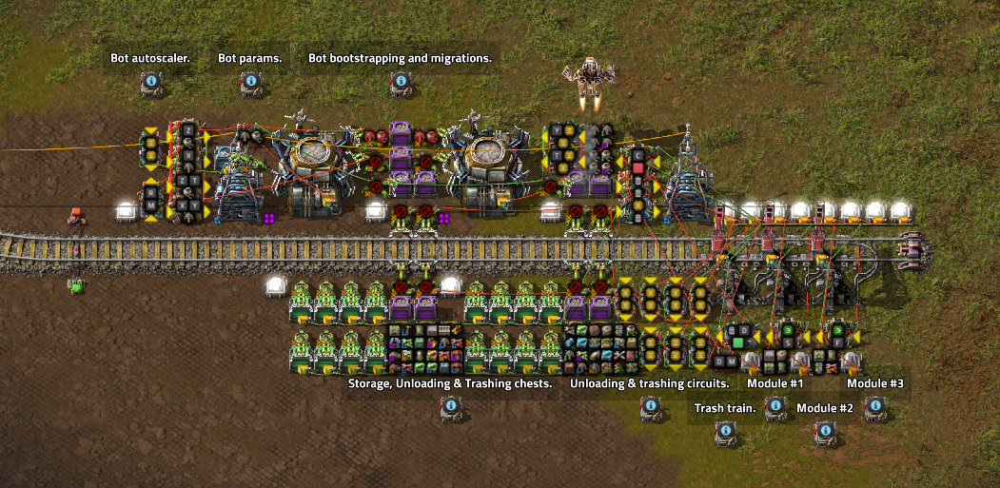

The outpost has the following new and old features:

- **NEW** Automatic bot upgrades and downgrades controlled from a constant combinator signal from any quality and quantity to any other quality and quantity.
- **NEW** Bot autoscaling to temporarily increase active bots by 10x for major construction or logistic events. When the system is idle the bots are removed and sent back to base.
- **NEW** Time delayed trash signal that is also capable of increasing train stop limit for larger trash events until complete.
- **NEW** Full support for normal through to legendary items, inserters, chests, bots.
- Automatic bot insertion into the roboports from the incoming train(s).
- Unloads 8x chest inserters at a time. 
- Loads trash train 8x chest inserters at a time.
- Request trains when a module detects less than 100% of that train's item is present.
- Unloads trains to 200% of desired items.
- Trashes untracked items or items above 300% of requested.

### Outpost Creation

Using the provided blueprints, create the outpost station and place some modules (in my case, the seed module and factory module). The seed module contains bots to initialize the logistic network.

[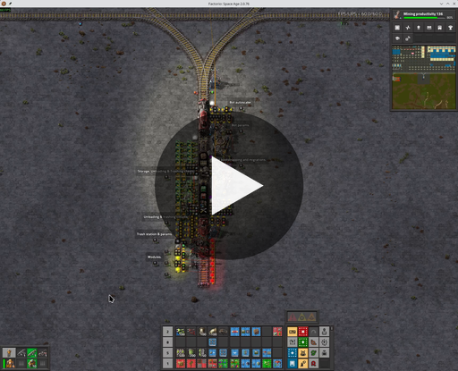](outpost-creation.mp4)

### Bot Configuration & Migrations

Here is a video showing the migration from 100x tier 1 logistic bots to 200x tier 3 logistic bots. Bots of all tiers are requested to the lower roboport. Wrong tier bots are removed. Missing tier bots are requested and inserted.

[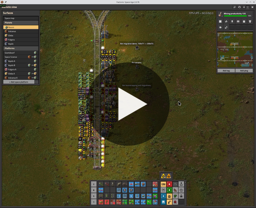](bot-upgrade-example.mp4)

As there is currently no per-tier breakdown of the bot statistics, the circuit only supports one tier of logistic and one tier of construction bots per network. If you look at the roboport near the train stops, you'll see some constant and arithmetic combinators converting the tier-less `T` and `Y` signals into per-tier negative masks.

### Bot Autoscaling

When the outpost detects there are no available logistic or construction bots, it temporarily injects additional bots into the logistic network up to `N` (10x) the configured amount or `M` (20) per roboport.

When the outpost detects bots are above the configured limits and all bots are idle, the extra bots are removed from the outpost roboports. If the bots in storage exceed 300% of the manifest signal, the trash train will return them to main base.

[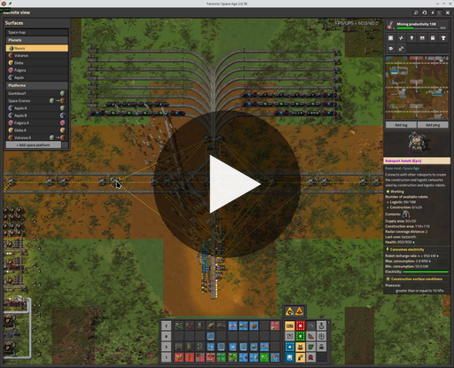](bot-autoscale.mp4)

You can observe that when the train deconstruction started, the construction bots jumped from 100 to ~600. If the work required was larger, additional seed trains would deliver more bots to be injected into the network.

The arithmetic combinator to detect and remove idle bots is vomit.

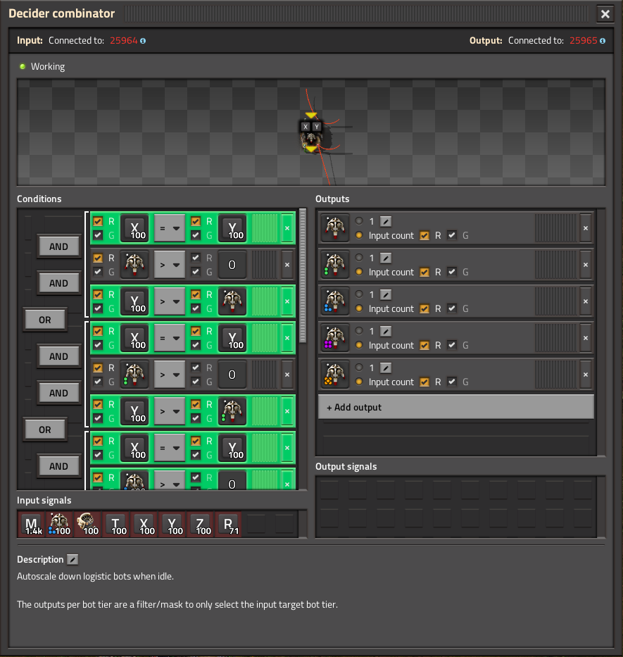

It feels like there is something simple missing to simplify the conditions and outputs here. Perhaps an item signal with an `[Each Quality]` quality selector in the input conditions and a single item output with `[Each Quality]`.

## The Trash Station

The trash station unloads outpost trash trains back into the main logistics network, staging items near the loading stations for re-use.

[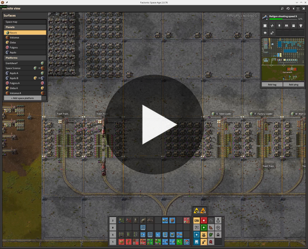](trash-storage.mp4)

A major annoyance with the prior versions was that I needed to keep the trash unloading station at or close to my main base storage because every item in the logistic train system would have to cycle through trash -> main storage -> loading station when using active provider chests.

Now I'm using a layer of filtered storage chests to keep the items local to the logistic loading stations and away from my main storage area.

The problem is that eventually the storage chests will fill up and unloading will stall. I've added a timer circuit that tracks how long a train has been in the station, and I use that to trigger a latch to dump all items from the storage chests into active provider chests.

When upgrading the trash area inserters, you can and should trim the unload time to match the inserter speed.

## The Loading Station

The loading station benefited most from Space Age's circuit improvements, though legendary inserters created new timing challenges.

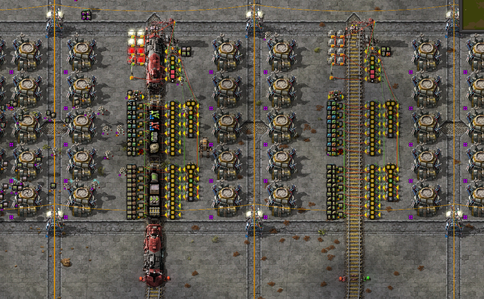

### Signal Groups

The introduction of global named signal groups in constant combinators has been a massive quality of life improvement. The modules and station manifests are now kept in sync automatically.

### One Signal Group

Previously, the modules and stations each used a separate constant combinator for each wagon of the logistic train. When adapting the circuit to Space Age, I realized it would be possible to use a single combinator and signal group with a value-based scheme to partition the items into each wagon. Eventually I settled on placing item counts that are <= a stack into the first wagon and item count > stack into the second wagon. This has worked well so far as most (of my) logistic train item usage curves follow an L-shaped curve (need many rails and landfill, moderate bots and belts, few chests and inserters).

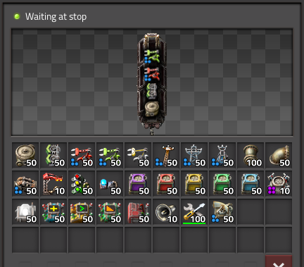
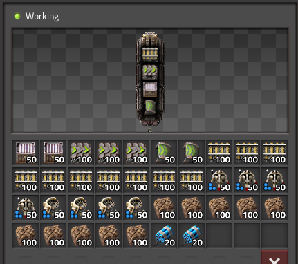

### Legendary Inserter Timing

Another problem was the legendary stack inserters, which were operating faster than the signal updates were propagating through my loading station circuit. Inserting with a stale item or stack size signal will over-insert items and overfill the wagon slots, causing the loader to stall. Lots of refactoring was required to reduce the number of ticks/hops it took to calculate the next hand item and stack size for fast and exact insertion.

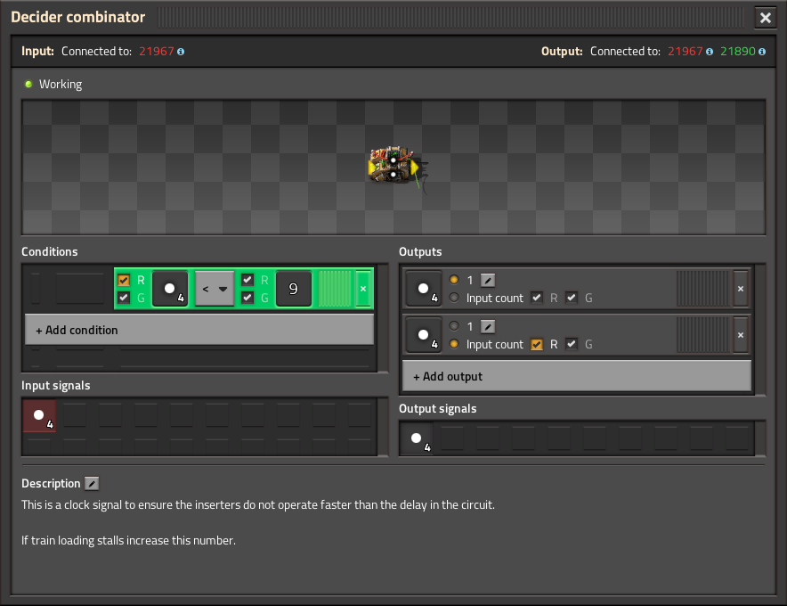

I used a combinator timer circuit to provide a clock signal to all loader inserters to ensure they all operate at the same time and with sufficient delay to ensure the hand and stack signals are up to date. Currently, 9 ticks are needed to calculate the next hand signal. I don't see an obvious way to improve this further. Either way, it's really fast and exact now.

## Feature Requests For Factorio 2.1

### Quality Wagons

It's been said elsewhere, I would also love to see this. Wagons should match the quality improvements to chests. Perhaps there should be some upgrade interrupt which can be used to park trains with wrong-tier wagons and then I could wire up some alarm to say a train needs upgrading.

### Read Roboport Network Contents

Add a fourth option to roboports to list the number, type, and quality tier of the bots in the logistic network. This could be called "Read roboport network contents".

It would be so much simpler to:

- set constant combinator with desired bot types, number & quality signals.
- subtract roboport network contents (types, number & quality).
- output to requestor chest to insert into roboport.

At the moment, I'm multiplying the `Y` and `T` signals with negative logistic and construction bot signals per-tier.

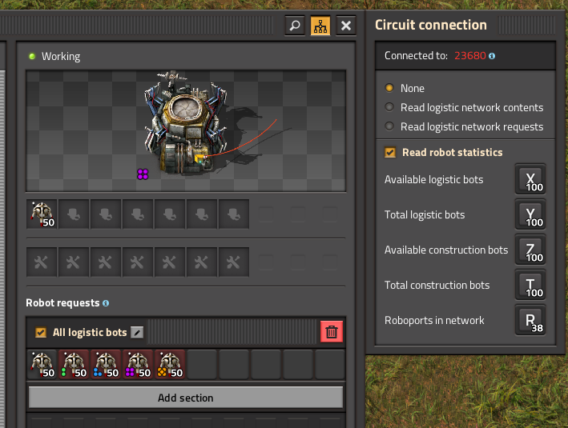
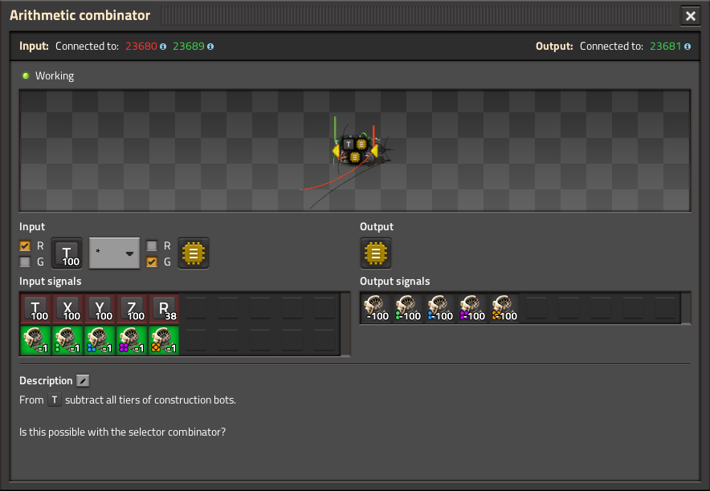

But this doesn't or wouldn't expose the available vs. total bots per quality tier which is needed elsewhere in this circuit and other circuits.

Perhaps there could be an option to output the bot network statistics by quality.

### Set Robot Requests In Roboports

It would be amazing if roboports supported a set bot requests signal to allow for rapid bot upgrades. At the moment I pick a roboport and set small requests for each tier and remove the non-configured tiers. Feels like a hack though.

Also, it would be nice if the roboports supported a "trash unrequested" to always leave room for non-configured tier bots to land and be removed.

### Roboport Bot Request Interference

There appears to be interference between quality logistic bot and quality construction bot requests in the roboport. In the provided blueprints, I had to request all logistic bots in one roboport and all construction in the other, otherwise some of the quality construction bot requests would not work.

### Arithmetic Combinator Multiple Outputs

Similar to the constant combinator, the arithmetic combinator could support multiple outputs/calculations. In the above example a single arithmetic combinator could compute the negative bot contents signal at once:

- `[ Y ] [ * ] [ -1 ] -> [ Construction Bot Tier 1 ]`
- `[ Y ] [ * ] [ -1 ] -> [ Construction Bot Tier 2 ]`
- `[ Y ] [ * ] [ -1 ] -> [ Construction Bot Tier 3 ]`
- `[ Y ] [ * ] [ -1 ] -> [ Construction Bot Tier 4 ]`
- `[ Y ] [ * ] [ -1 ] -> [ Construction Bot Tier 5 ]`
- `[ T ] [ * ] [ -1 ] -> [ Logistic Bot Tier 1 ]`
- `[ T ] [ * ] [ -1 ] -> [ Logistic Bot Tier 2 ]`
- `[ T ] [ * ] [ -1 ] -> [ Logistic Bot Tier 3 ]`
- `[ T ] [ * ] [ -1 ] -> [ Logistic Bot Tier 4 ]`
- `[ T ] [ * ] [ -1 ] -> [ Logistic Bot Tier 5 ]`

### Parameters In Constant Combinator Groups

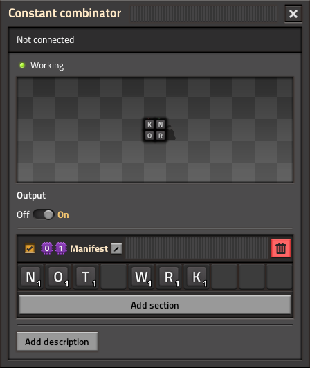

When trying to create a blueprint for a new logistic train group I used `[P0][P1]` for the module station name, `[P0][P1] Loader` for the loader station, and `[P0][P1] Manifest` for the constant combinator signal group. However, when placing the blueprint, the signal group name parameters are not changed.

Typically, I set `[P0]` as the current planet and `[P1]` as some unused letter symbol for my trains (`[F]` for factory, `[W]` for perimeter wall, `[S]` for seed/common items, `[M]` for mining/pumping items, etc) so that I can re-use the station names with custom manifests per planet.

## Conclusion

The system is faster and more capable than prior versions while being more compact thanks to signal groups and improved circuits. Quality items add complexity, but the core design remains unchanged after 6 years. The factory grows, now across multiple planets.

## Blueprints

You can download the logistic train blueprint book [here](masons-logistic-trains-blueprint.txt).

And a simple rail blueprint book [here](masons-simple-ground-rails.txt).

## Discussion

- [/r/factorio](https://www.reddit.com/r/factorio/comments/1sve97j/masons_space_age_logistic_train_system/)
- [/r/technicalfactorio](https://www.reddit.com/r/technicalfactorio/comments/1sve9l9/masons_space_age_logistic_train_system/)
